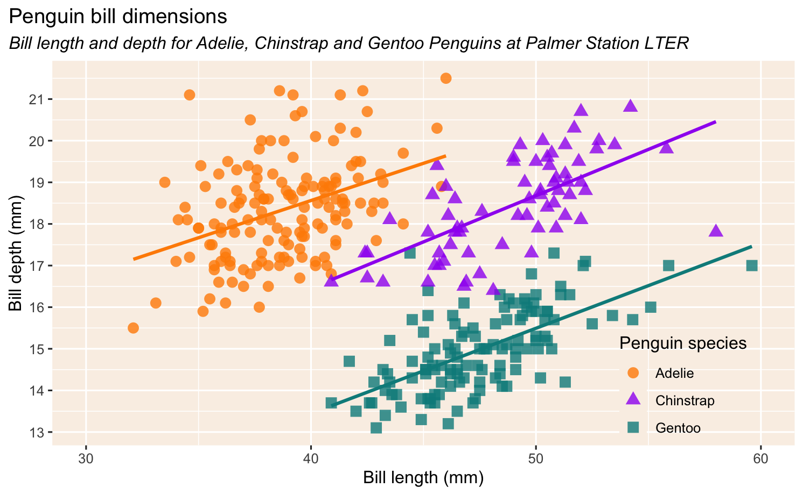

# Introduction to R Part 3: ggplot

Welcome to the Part 3 of the [FAS Informatics :material-arrow-top-right:](https://informatics.fas.harvard.edu/){:target="_blank"} Intro to R workshop! 

If you're viewing this file on the website, you are viewing the final, formatted version of the workshop. The workshop itself will take place in the RStudio program and you will *edit and execute the code in this file*. Please download the raw file [here :octicons-download-24:](R-workshop-Part3-student.Rmd).

## Data visualization in R with ggplot2

Conveying research findings in a meaningful way is an integral part to being a scientist, almost as important as performing research itself. The scale of modern biological data compounds its importance -- we now need to summarize and condense millions of data points into meaningful, easy to understand figures while still showing the scale and variance in our data. All of which leads to the need for scientists to be able to programmatically generate visualizations for exploratory analysis, to convey conclusions, and for reproducibility of final figures.

In addition to statistical analysis, the R programming language and the RStudio IDE are built for this task, and while many people are able to generate figures with these programs, there can be a steep learning curve. The goal of today's workshop is to introduce you how to use the skills you've learned in the previous workshops to manipulate data and visualize it in RStudio. We'll touch a little bit on plots that can be generated by R itself (referred to as "base R"), but spend much of the time showing you the tidyverse plotting package, ggplot.


## Introduction to ggplot

[ggplot :octicons-link-external-24:](https://ggplot2.tidyverse.org/){:target="_blank"} is a **package** (library of code with various functions) that is part of the **tidyverse**. It uses a somewhat standardized 'grammar of graphics' ([book :octicons-link-external-24:](https://id.lib.harvard.edu/alma/990082021020203941/catalog){:target="_blank"}; [paper :octicons-link-external-24:](https://hollis.harvard.edu/permalink/f/1mdq5o5/TN_cdi_informaworld_taylorfrancis_310_1198_jcgs_2009_07098){:target="_blank"}) in its syntax to make almost every aspect of a plot customizable. The input to ggplot are **data frames** and **tibbles**, and the best way to organize your data so that it is easily plotted is by ggplot is following the **tidy** principles, which is why it's part of the tidyverse.

If you haven't already, download and install the tidyverse bundle of packages and load it. ggplot2 is one of the packages bundled with it. We'll also install and load the `palmerpenguins` package, which contains the sample dataset we're working with.

Do so by running this code block (by clicking the green triangle in the upper right, or by placing the cursor in the code block and using *ctrl+enter*/*cmd+enter*.)

```{r, message=FALSE, warning=FALSE}

installed_packages <- rownames(installed.packages())

for (pkg in c("tidyverse", "palmerpenguins")) {
  if (!pkg %in% installed_packages) {
    install.packages(pkg, quiet = TRUE)
  }
  library(pkg, character.only = TRUE)
}
```

As noted above, we're going to be working with the `penguins` data set. This is a dataset of mixed data, meaning some variables are categorical and some are numerical, collected about penguins at a research station. It is organized so that each row is a single penguin and each column are the measurements taken of the penguins. You can view the data set by running the following code block:

```{r}
glimpse(penguins)
```

## Building a basic plot: aesthetics and layers

What goes into constructing a plot? Let's begin by going over two important concepts of ggplot: **aesthetics** and **layers**.

As described in the [official ggplot2 handbook](https://ggplot2-book.org/){:target="_blank"}, every plot consists of:
| 1. **data**
| 2. A set of **aesthetic mappings** between variables in the data and visual properties of the plot
| 3. At least one **layer** that describes how to render each observation

Let's start from the top! A ggplot starts by defining a graphical object (or **grob**) with the `ggplot()` function and telling it the source of the data for the plot, like this:

```{r}         
ggplot(penguins)
```

This is the **data** we want to plot. However, in the above example, only a grey box is displayed. This is because, while we've told ggplot *which* dataset to use (`penguins`), we haven't told it what *parts of the data* to plot yet. To do so, we need to specify the variables to plot along each axis as **aesthetics**.

For example, if I wanted to plot two columns from the `penguins` dataset called `bill_length_mm` and `bill_depth_mm` that I wanted to use in my plot, I would do the following:

```{r}         
ggplot(penguins, aes(x = bill_depth_mm, y = bill_length_mm))
```

Now, it looks like we have added axes on our white box, but nothing else. At this point, we've told ggplot the dataset to use (`penguins`) and which parts of that dataset to use (`bill_length_mm` and `bill_depth_mm`), but now *how* to display the data.

We need to tell ggplot how to interpret the aesthetics as a graphical representation, i.e. do we want points, lines, bars, etc. We do this by adding **layers** onto the plot with the `+` operator. Each `+` indicates a new layer in the specified ggplot object and many layers can be added to a single plot in order to display the data in different ways. In general, layers can either *display the data*, display a *statistical summary* of the data or *add additional metadata* (context, annotations, etc) to the plot. The layer we add when telling ggplot how to plot the aesthetics (data) is usually called a **geom** (short for geometry).

There are many types of geoms depending on what relationship you are trying to plot. A list of geoms can be found [here :octicons-link-external-24:](https://ggplot2.tidyverse.org/reference/#geoms){:target="_blank"}. For example, let's say we want to visualize the distribution of the penguins' body mass. Single distributions are typically plotted as histograms or density plots. So to generate the histogram, we would follow these steps:

1.  Specify the dataset (in our case, `penguins`)
2.  Identify the variables in the dataset to plot and specify them as aesthetics. This will require you to look at your data! For our first example, it will be `body_mass_g`
3.  Add a geom layer with the `+` operator that tells ggplot how to display the specified data:

Here's what that looks like. Run the following code block:

```{r}
ggplot(penguins, aes(x = body_mass_g)) +
  geom_histogram()
```

A great feature of ggplot is that it does calculations and data transformations for you under the hood. In this code, we only specified that we want the x axis to be body mass and `geom_histogram()` automatically inferred that we want the counts of the body mass to be plotted on the y. It also calculated how wide each bin should be given a default bin number of 30.

Importantly, each layer itself is a function that can take **arguments** (or **parameters**/**options**) as input within the `()` to further customize how the data is handled and displayed. For example, `bins` and `bindwidth` are parameters you can give to the geom_histogram() function to customize the calculations ggplot does under the hood.

Let's use this information to now plot a histograms of the penguin `body_mass_g` variable with different bin parameters:

```{r}
ggplot(penguins, aes(x = body_mass_g)) +
  geom_histogram(binwidth=50)
ggplot(penguins, aes(x = body_mass_g)) +
  geom_histogram(bins=10)
```

If you are ever uncertain of what arguments a layer function takes or what a particular argument is doing, you can bring up the manual page in the Rstudio IDE by typing `?function`. E.g.

```{r}
?geom_histogram
```


## Exploring other plot types

So far, we've only looked at a single type of plot, `geom_histogram`, but there are many more option in `ggplot`, and even more in the various add-on packages to `ggplot`! Let's look at another plot type you are likely familiar with, the scatterplot, which uses `geom_point`.

> In the code block below, using the same aesthetics we used for the histogram, use `geom_point` to draw a scatterplot of body_mass_g:

```{r, error=TRUE}
ggplot(penguins, aes(x = body_mass_g)) +
  geom_point()
```


OK, what is going wrong here? If we look at the error message, we can see that we are missing an **aesthetic** property; unlike with `geom_histogram`, which only requires a single variable (the `x`), `geom_point` requires both an `x` and a `y`...which makes sense, as scatterplots are all about comparing two variable against each other, while a histogram shows the distribution of a single variable.

Let's pick another variable from our penguins dataset, `bill_length_mm`.

> **Exercise**
> In the clode block below, plot a scatterplot with geom_point showing the distribution of body mass vs bill length:

```{r}
ggplot(penguins, aes(x = body_mass_g, y = bill_length_mm)) +
  geom_point()
```


### A quick word on variable types and geom selection
If we take a look at the [quick reference guide :octicons-link-external-24:](https://rstudio.github.io/cheatsheets/data-visualization.pdf){:target="_blank"} for ggplot, we can see that the geoms are grouped based on whether they take a single variable or multiple, and whether the variables are **discrete** or **continuous**. As we remember from stats class, a "discrete" variable is any variable with values that are *distinct* and countable (i.e. not infinite), while a "continuous" variable can be any value within a range. When plotting, it is always important to consider the nature of your variable(s) and what you are trying to convey, and pick the appropriate `geom` for the job.

> For example: if we want to visualize the distribution of body mass of the birds, would plotting it this way make sense??

```{r}
ggplot(penguins, aes(x=body_mass_g)) +
  geom_bar()
```

We can see that the above code WILL produce a plot without throwing an error (except for the usual "missing data" warning), and the plot even looks vaguely plausible. However, this is probably not the way we want to visualize this particular data...we can see that `geom_bar` is intended for a *single, discrete variable*, whereas data like "body mass" is a continuous variable. If we look closer at the plot, we can see that what is happening is `geom_bar` is *counting* the number of times each discrete body mass value occurs in the data. A better way to visualize this would be with a histogram or density plot.

> Exercise: check out the ggplot [quick reference guide :octicons-link-external-24:](https://rstudio.github.io/cheatsheets/data-visualization.pdf){:target="_blank"} and choose a geom of your liking, then try adapting it to our penguins data.

```{r}
ggplot(penguins, aes(x=body_mass_g)) +
  geom_density()
```


## Adding new data to a ggplot
We know that a `ggplot2` plot requires at least one **layer** (i.e. a **geom** function), but because of `ggplot2`'s modularity, it can take multiple **geom** layers in a single plot. All we need to do is simply add the new layer using the `+` symbol as before. As a reminder, a **layer** in ggplot can display data, a statistical summary or some additional metadata.

To explore this, if we "eyeball" the scatterplot we just made showing beak length by body size, we can maybe see that there is a relationship between the two variables. However, let's evaluate this more thoroughly.

> **Exercise**
> Look up the `geom_smooth` function, then add it to the scatterplot to plot a linear fit line to our data (using just the default settings for `geom_smooth`). Hint: remember you can look up manual pages for functions in Rstudio by typing `?function_name` in the `Console` window 

```{r}
ggplot(penguins, aes(x = body_mass_g, y = bill_length_mm)) +
  geom_point() +
  geom_smooth()
```

Nice, we can see much more clearly that bill length is correlated with mass!

Certain `geoms` won't make sense to combine together in a single plot, and others may have **aesthetic mappings** that are incompatible with one another. That raises the question, how exactly are **aesthetic mappings** shared by different layers? Let's explore that next!


### Mapping vs setting aesthetics

Different **geoms** have different visual properties (aesthetics) that can be assigned to variables. Here's a list of the most common properties. Underlined are the ones that are valid for this `geom_histogram()`:

-   [color]{.underline}: this changes the color of the line or points
-   [fill]{.underline}: if the shape is filled, this changes the fill color. Filled shapes are used in bar plots, box plots, and histograms. Points are generally not filled.
-   shape: if your geom is a point, this changes the shape of the point. (Some shapes are filled, some aren't)
-   size: this changes the size of the point or line
-   [linetype]{.underline}: If the geom has a line, including if it's an outline, this changes the type of line (dotted, dashed, etc)
-   [alpha]{.underline}: this changes the transparency of the geom

Let's change some of the mapping properties of the histogram plot we made by using these aesthetics inside the `geom_histogram()` function:

```{r}
ggplot(penguins, aes(x = body_mass_g)) +
  geom_histogram(color = "black", fill = "blue", linetype="dashed", alpha=0.6)
```

In the above code, we used aesthetic mappings to change the visual properties of all the histogram bars at once. This is called **setting** the aesthetic property. Another thing we can do is **mapping** the aesthetic property to a variable in the data. This is done by putting the aesthetic inside the `aes()` function, just like how we map variables to `x` and `y`. This is useful when you want to color the bars by a variable in the data, like the species of the penguin:

```{r}
ggplot(penguins, aes(x = body_mass_g, fill = species)) +
  geom_histogram(color="black")
```

In the above code, we have **mapped** the fill aesthetic to the species variable in the data. By mapping an aesthetic property to a variable, the bars are colored by that variable and ggplot automatically generates a legend that matches.

Also notice how we have **set** the color of the outline of all the bars to be black. This is because the color aesthetic is not placed inside the `aes()` function, so it applies to every piece of data. Here's what happens if you put `color="black"` inside the `aes()` function:

```{r}
ggplot(penguins, aes(x = body_mass_g, fill = species, color = "black")) +
  geom_histogram()
```

And here's what happens when I try to put `fill=species` outside of the `aes()` function.

```{r error=TRUE}
ggplot(penguins, aes(x = body_mass_g)) +
  geom_histogram(color="black", fill=species)
```

R is throwing an error because it is only inside the `aes()` function that you can directly reference a variable in the data.

> **Exercise**
> Make a density plot of body size and have the fill color be by species and the line color by sex. Make the distributions slightly transparent for better visualization.

```{r}
ggplot(penguins, aes(x=body_mass_g,fill=species, color = sex)) +
  geom_density(alpha = 0.6)
```


To sum, in this section, we learned that you can set an aesthetic property to be constant across all data by putting it outside the `aes()` function or you can map it to a variable by putting it inside. Later, we will learn that you can override the aesthetic by putting an `aes()` function inside the `geom` function.


### Inheriting aesthetics

But first, we'll explore more about how adding another geom layer to the plot interacts with mapping aesthetics!

In the below code, we will display data as a scatter plot using `geom_point()` layer. Since scatter plots require an x and y axis, in our `aes()` call we'll have to specify both. Let's compare the penguins' body mass with their bill lengths. We used `body_mass_g` and bill length is stored in the `bill_length_mm` column of our data. We will also add another geom layer, `geom_smooth()`, which is a function that will calculate and add a linear fit to the points.

```{r}
ggplot(penguins, aes(x = body_mass_g, 
                     y = bill_length_mm, 
                     color=species)) +
  geom_point() +
  geom_smooth(method = "lm", se=FALSE) ## add linear fit, without confidence interval
```

You can see that the linear fit is done to each species separately. This is because geoms by default **inherit** the aesthetics (and the data) from the `ggplot()` function. This is a very useful feature of ggplot that allows you to easily add layers to your plot without having to specify the data and aesthetics again.

What happens when we put the `aes(color=species)` inside the `geom_point()` function?

```{r}
ggplot(penguins, aes(x = body_mass_g, y = bill_length_mm)) +
  geom_point(aes(color=species)) +
  geom_smooth(method = "lm", se=FALSE)
```

In the above figure, now the `geom_smooth()` function ONLY inherits the x and y aesthetic options and knows nothing about the species, which is why you only see a single linear fit across all the data. When you are layering multiple geoms together, you can more finely control how the aesthetics are mapped by putting them inside the `geom` function.

To sum up this section, we learned that you can layer geoms on the same graph to show different relationships in the data. Each geom can inherit the aesthetics from the `ggplot()` function, but you can also override these aesthetics by specifying them in the `geom` function.

### In summary: handy vocab quick-ref

Here's some vocabulary to tie it together:

| Term/Function | Definition/Description                                                                               |
|---------------------|---------------------------------------------------|
| tidy data     | Data where variables are in columns and observations are in rows. Easiest for plotting               |
| `ggplot()`    | Function that initializes a ggplot object                                                            |
| `aes()`       | Function that specifies the aesthetics of the plot                                                   |
| aesthetics    | Graphical properties governing how the data is displayed/mapped, e.g. x, y, color, fill, shape, etc. |
| `geom_*()`    | Function that specifies the type of plot to be drawn                                                 |
| layer         | A layer is a function that adds a new element to the plot, such as labels or new geoms               |
| `+`           | Operator that adds a new layer to a ggplot object                                                    |
| map/mapping   | Make an aesthetic property of a plot dependent on a variable in the data                             |
| set           | Make an aesthetic property of a plot constant                                                        |


## Customizing non-data aspects plots: lab(el)s, scales, and themes

We've now learned how to use the `aes()` function to control how are variables are represented in the plot. Each geom has a set of aesthetics that can be mapped to the data or set as constant across all the data in the plot. By default, the ggplot package decides everything else about the plot, such as the axis labels, the colors, the background color, the legend position and size, etc. However, you can customize all of these things. The tricky part is knowing what kind of function to use to customize each aspect of the plot.

Here is the big design principle behind ggplot:

> **A ggplot (the object) is composed of data elements and non-data elements, and the key to figuring out how to change something is identifying whether that thing depends on the data or not.**

Let's define some terms:

A **data element** is something that was drawn onto the plot that is directly based on the data. These include things we've already talked about like:

-   bars in a bar plot
-   points in a scatter plot
-   all the aesthetic mappings of the geoms (shape, color, etc)
    -   everything about them, including the labels, the values, the order

But it also includes more subtle things like:

-   the labels on the tick marks of x and y axes and their order
-   the location of the x and y tick marks
-   the exact icon that the legend uses
-   the content of the text of the labels in the legend

A **non-data element** is something that is not directly based on the data, but is still part of how the plot looks visually. These include things like:

-   the font, font size, color, etc of text labels
    -   (except when you're plotting text with `geom_label`/`geom_text`)
-   the background color of the plot panel
-   the grid marks in the plot panel
-   the position of the legend
-   whether a legend appears at all
-   the position of any of the axis labels (both ticks and titles)
-   whether the axis lines are drawn at all
-   the margins of the plot
-   so much more!

The reason why understanding the difference between data and non-data elements is important is because there are different sets of functions that control each of these things. We are not going to cover every set of functions that governs visual appearance in ggplot, but hopefully by understanding this concept, when you see new code "in the wild", you will be able to understand how that worked and then make it your own.

In this next section, we will go through the steps to recreate a more complex plot. Often, we have an idea in our minds about what we want the graph to look like. For example, let's pretend this is what we want our graph to look like:

#### Example plot



#### Base plot

Right now, this is our code based on what we've learned so far about mapping and setting aesthetics and layering geoms. We know where to put the `color` aesthetic and where to put the `shape` aesthetic, and how to prevent the legend from `geom_smooth` from showing. From a data perspective, all the same information is there, but it just looks not so great.

So, since we want to experiment, we can save this plot to an object with the syntax `g <- ggplot()` . This creates an object called `g` in our environment that contains all the information to recreate this base plot. The nice thing is, as we will see, you can directly add layers with `+` to the plot object `g` as you experiment with changing the visual elements.

```{r}
g <- ggplot(data=penguins, aes(x = bill_length_mm, 
                               y = bill_depth_mm, 
                               color = species)) + 
  geom_point(aes(shape = species)) +
  geom_smooth(method = "lm", se = FALSE, show.legend = F)
g
```

#### Base plot with labels

The first thing we want to do is to add a title, subtitle, x an y axis labels, and also a better legend title. All this can be accomplished with another layer called `labs()`. In the below code block, we are using our saved ggplot object called `g` from above so we don't have to type everything again to create the base plot. Using `g + blah()` allows us to add another layer without modifying the base plot.

Notice how we added a title to the `color` aesthetic and it separated out that aesthetic from the `shape` aesthetic! This is because now `shape` and `color` now have two different names, one derived from the data and one provided by the `labs()` function.

```{r}
g + 
  labs(title = "Penguin bill dimensions",
       subtitle = "Bill length and depth for Adelie, Chinstrap and Gentoo Penguins at Palmer Station LTER",
       x = "Bill length (mm)",
       y = "Bill depth (mm)",
       color = "Penguin species")
```

To fix this, we need to set both aesthetics to the same name. We could save this as our new base plot, but as we'll see later, the order of how we add layers matters, so we'll hold off for now.

```{r}
g + 
  labs(title = "Penguin bill dimensions",
       subtitle = "Bill length and depth for Adelie, Chinstrap and Gentoo Penguins at Palmer Station LTER",
       x = "Bill length (mm)",
       y = "Bill depth (mm)",
       color = "Penguin species",
       shape = "Penguin species")
```

#### Adding color scale

Let's keep working from the base plot. The next major difference between our current plot and our ideal plot that we're going to tackle is the color, transparency, and the size of the shapes. All of these are aesthetic qualities, which mean it is about how the data are presented. So we'll need to modify the `geom` function and use a new type of function called a `scale` function. First let's modify the `geom_point` to change the size and transparency of the points.

Remember that due to inheritance, we will need to re-specify that we want the geom_point's `aes` to assign `shape=species`. Also we will be setting the size and transparency (aka **alpha**) for all points so it goes outside the `aes` .

```{r}
g + 
  geom_point(aes(shape=species), size=3, alpha = 0.8)
```

Now what about the difference in color? We can use a function of the class `scale_color_*`. The `scale_*_something` functions are a class of functions that customize how aesthetics are mapped. The word after scale is the aesthetic you want to customize and the third word is usually either `continuous/discrete/manual/brewer` depending on whether you are plotting a numerical or categorical variable or whether you want full control over everything. So you can have `scale_fill_manual()` to manually map the fill aesthetic, `scale_color_discrete()` and `scale_color_continuous()` to map discrete or continuous values from your variable onto a color scale, etc.

R has built-in color names and that we can input that to `scale_color_manual`. There are 657 built in color names in R. You can see a list of them using the `colors()` function, type `demo("colors")` for an interactive tour of all of them, or simply search for an image of all the colors online. For now, we will cheat and I will provide that the original plot was made with the colors "darkorange", "purple" and "cyan4". These can be entered in order to the `values` parameter of `scale_color_manual`.

```{r}
g + 
  geom_point(aes(shape=species), size=3, alpha = 0.8) +
  scale_color_manual(values = c("darkorange", "purple", "cyan4"))
```


We can control other things with scales for aesthetics too! For instance, when manually setting colors using `scale_color_manual`, let's say we want to assign specific colors to a specific species, rather than the default behavior where colors are assigned in variable factor order. The other things you can change in `scale_color_manual` is how each color is mapped to each discrete value and also how each discrete value is labeled. We can explicitly set key:value pairs inside this to control which penguin gets which color. The keys must be how they are stored in the data. But if how they are stored in the data is not what we want to display, like common name instead of scientific name, we can then label these penguins whatever we want using the `label` parameter.


```{r}
g + 
  geom_point(aes(shape=species), size=3, alpha = 0.8) +
  scale_color_manual(values = c("Chinstrap"="darkorange", "Adelie"="purple", "Gentoo"="cyan4")) +
  labs(title = "Penguin bill dimensions",
       subtitle = "Bill length and depth for Adelie, Chinstrap and Gentoo Penguins at Palmer Station LTER",
       x = "Bill length (mm)",
       y = "Bill depth (mm)",
       color = "Penguin species",
       shape = "Penguin species")
```


BONUS: pre-made color palettes

We can use `scale_color_brewer` to take advantage of pre-made discrete color palettes. To see all the options type `RColorBrewer::display.brewer.all()` in your console. For more information on how to generate custom palettes, use rgb values to specify colors, and more, see chapter 12 "Using Colors in Plots" in the [R Graphics Cookbook :octicons-link-external-24:](https://r-graphics.org/CHAPTER-COLORS){:target="_blank"}.

```{r}
g + 
  geom_point(aes(shape=species), size=3, alpha = 0.8) +
  scale_color_brewer(palette = "Dark2")
```


#### Adding X/Y axis scale

One of the other differences between what we have now and the example plot are the X and Y axis tick marks. You will notice that in the example plot, there are many tick marks on the Y axis and a few additional ones on the X axis as well. Is this element of the plot a data-driven visual element or a non-data element?

If you guessed data-driven, you are correct! The spacing (or, **scaling**) of X and Y axes is typically automatically decided by ggplot based on the distribution of your data. This is how you always end up with a plot that shows all your data and not a ton of empty space to either side.

The way we can customize the X and Y axis scaling is with the set of functions `scale_x/y_something`. The "something" can be a transformation, like `log10`, or `continuous()`/`discrete()`. We are plotting continuous variables on both axes so we will use `scale_x/y_continuous()`

The arguments for these functions include

-   name: another way to set the axis label

-   breaks: the positions where there will be tick marks and text labels

-   n.breaks: alternatively, tell ggplot how many breaks you want

-   labels: how you want to label the tick marks

-   limits: the min and max value of the axis

The below code demonstrates how to manually set the breaks and limits for the x axis to match the example plot. We use `seq()` to create a vector of numbers from 30 to 60 with a step size of 10. Those are the breaks - where the tick marks will be. We also make sure that the limits include those breaks, as the base plot had slightly narrower x limits.

```{r}
g + 
  scale_x_continuous(breaks=seq(30,60,10), limits = c(30,60))
```

In the code block below, we will use the `n.breaks` argument in `scale_y_continuous` to add the number of breaks we want without having to manually create them. Now our axes look just like the example!

```{r}
g + 
  scale_x_continuous(breaks=seq(30,60,10), limits = c(30,60)) +
  scale_y_continuous(n.breaks = 10)
```


Scaling the axes works for discrete variables as well! For example, here is a bar plot (which plots a *single discrete variable*) that simply counts the number of species:

```{r}
ggplot(penguins, aes(x = species, fill=species)) +
  geom_bar(stat='count')

```

Let's say that we want to change the *ordering* that the species (our discrete variable) are plotted in. We can do this using the counterpart function to `scale_x_continuous` called, predictably, `scale_x_discrete`.

> **Exercise**
> Consult the documentation for `scale_x_discrete` to figure out how to change the ordering of the bars to be "Chinstrap", "Gentoo", "Adelie". Hint: check the examples at the bottom of the documentation help page!

```{r}
ggplot(penguins, aes(x = species, fill=species)) +
  geom_bar(stat='count') +
  scale_x_discrete(limits = c("Chinstrap", "Gentoo", "Adelie"))
```


#### Base plot with all data elements

In the last sections we learned how to use `labs()`, `scale_color_manual()` , and `scale_x/y_continuous()` to affect change on the visual elements of the plot that depend on data. Let's put those together and see how close we are to the example plot.

> **Exercise**
> Using the code we went thru above, to the base plot (i.e. the object we saved as `g`), add:
> - the `geom_point` layer 
> - the manual color scale 
> - the continuous x axis scale with the right breaks and limits
> - the continuous y axis scale with set number of breaks
> - the labs() layer with the titles, subtitle, and legend labels

```{r}
g + 
  geom_point(aes(shape = species),
             size = 3,
             alpha = 0.8) +
  scale_color_manual(values = c("darkorange","purple","cyan4")) +
  scale_x_continuous(breaks=seq(30,60,10), limits = c(30,60)) + 
  scale_y_continuous(n.breaks=10) + 
  labs(title = "Penguin bill dimensions",
       subtitle = "Bill length and depth for Adelie, Chinstrap and Gentoo Penguins at Palmer Station LTER",
       x = "Bill length (mm)",
       y = "Bill depth (mm)",
       color = "Penguin species",
       shape = "Penguin species")
```


#### Theme

The remaining differences between this plot and our current plot are all due to the **non-data elements** of the plot. These include: the italicized font of the subtitle, the background color of the plot panel, the position and color of the legend. All these non-data elements can be edited using the `theme()` function.

Themes govern practically everything that isn't about how your data is presented, and it can be hyper-specific. For example, here is a diagram of the most common theme elements covering things you would never have thought could be customized. Changing an element of a plot generally entails first finding out what it is called in the theme. This is definitely **NOT** something you need to memorize.


In the below code, we've assembled all of our previous layers and added on the theme elements that need to be changed to create, finally, the look of the example plot. Let's go thru and try to figure out what each other the arguments in the `theme()` function are doing (remember: if you ever forget what exactly a function does or what arguments it takes, you can always type `?` and the the function's name in the R console):

```{r}
g_final <- ggplot(data = penguins, 
       aes(x = bill_length_mm,
           y = bill_depth_mm,
           color = species)) +
  geom_point(aes(shape = species), 
             size = 3, 
             alpha = 0.8) +
  geom_smooth(method = "lm", 
              se = FALSE, 
              show.legend = FALSE) +
  scale_color_manual(values = c("darkorange","purple","cyan4")) +
  scale_x_continuous(breaks=seq(30,60,10), 
                     limits = c(30,60)) + 
  scale_y_continuous(n.breaks=10) + 
  labs(title = "Penguin bill dimensions",
       subtitle = "Bill length and depth for Adelie, Chinstrap and Gentoo Penguins at Palmer Station LTER",
       x = "Bill length (mm)",
       y = "Bill depth (mm)",
       color = "Penguin species",
       shape = "Penguin species") +
  theme(legend.position.inside = c(.85,.15),
        plot.subtitle = element_text(face= "italic"),
        plot.subtitle.position = "plot",
        plot.title.position = "plot",
        panel.background = element_rect(fill="linen"),
        legend.background = element_blank())
g_final
```


The adjustments made are:

-   place the legend inside the plot panel

-   adjust position of inside legend to the lower right

-   italicized the plot subtitle

-   changed the plot panel background color to "linen"

-   removed the default white legend background color (you'll see what this means if you remove this line)


BONUS: pre-built themes

ggplot has many built-in complete themes that overhaul plots to look differently. Here's a few of them. See how the same plot can look really different by just picking a bundled theme.

```{r}
g_final + theme_dark()
g_final + theme_minimal()
g_final + theme_void()
```


## Plotting multiple plots in one window with facetting

In almost any scientific paper you will see figure with multiple panels, with subsets of plots split by some categorical variable (e.g. "treatment" vs "control" etc.) The coward's route is to make the plot individually, then combine them in Powerpoint or Illustrator, but there is no need! `ggplot2` provides an easy way to compare groups in different panels called **facetting**. The function `facet_wrap()` allows you to split your plot into a 2D sequence of rows and columns based on a given variable. 

We specify a variable in our **data** with the syntax `facet_wrap(vars(variable))` and `facet_wrap` will group the data set into facets based on the values of that variable, allowing us to compare and contrast patterns in different groups (or pairs of groupings). For example, if we go back to our scatterplot showing bill length vs body size, say we want to split the data based on the sex of the birds:

```{r}
ggplot(penguins, aes(x = body_mass_g, y = bill_length_mm)) +
  geom_point() +
  geom_smooth() + 
  facet_wrap(vars(island))
```

As a note, an alternate (classic) syntax for specifying the facetting variable that you might see in other peoples' code is `facet_wrap(~variable)`. So the following code would be equivalent to what we just ran:

```{r}
ggplot(penguins, aes(x = body_mass_g, y = bill_length_mm)) +
  geom_point() +
  geom_smooth() + 
  facet_wrap(~island)
```


`facet_wrap()` is primarily useful for when you have a single variable with many levels that you want to wrap (i.e. 1D -> 2D). While you CAN provide multiple variables, it looks a little janky...

```{r}
ggplot(penguins, aes(x = body_mass_g, y = bill_length_mm)) +
  geom_point() +
  geom_smooth() + 
  facet_wrap(vars(island, year))
```

If we want a matric of panels with rows and columns based off of two variables, we can instead use the related function `facet_grid()`, which will facet the plot into rows and columns based off of every combination of the two provided variables! Let's try it out...

> **Exercise**
> Consulting the documentation for `facet_grid`, make a scatter plot with a smoothed fit line split by island and year. 

```{r}
ggplot(penguins, aes(x = body_mass_g, y = bill_length_mm)) +
  geom_point() +
  geom_smooth() + 
  facet_grid(rows = vars(island), cols = vars(year))
```


------

## Integrating ggplot2 and tidyverse

### Grouping and summarizing data and plotting
Let's look at some of the other ways `tidyverse` can help us when making plots. Often when analyzing our data, we will want to generate summary statistics for various groups of observations. In a previous sections we discussed the `tidyverse` functions `group_by()` and `summarize()`, which can help us do just that!

To review, to use `group_by()` we specify one or more variables (i.e. columns) in our tibble that we want to use to define the groups in our data. We then pass the grouped data to `summarize()` and apply a function (which can be built-in `R` functions like `mean` or our own custom ones) to each group, outputting a summary. We can either save this summary to a new tibble, OR we can feed it straight into `ggplot`! 

For example, rather than plotting a distribution, let's say we want to make a bar plot that shows the AVERAGE body mass of male vs female penguins.

> **Exercise**
> Using what we learned in previous classes, create a new tibble called `aver_mass` that summarizes the average mass of male vs female birds (hint: don't forget about the `NA` values!). Plot the new tibble as a *bar plot* using `geom_col`.

```{r}
aver_mass <- penguins %>%
  group_by(sex) %>%
  summarise(mean_mass = mean(body_mass_g, na.rm=TRUE))
aver_mass

ggplot(aver_mass, aes(x=sex, y=mean_mass)) +
  geom_col()
```


In the above example, we first define and save a new tibble with the averages of the body mass before plotting it, but we don't actually have to do it that way...because `ggplot` is a part of `tidyverse`, we can pipe the output of the `tidyverse` functions directly into our plot command!

```{r}
penguins %>%
  group_by(sex) %>%
  summarise(mean_mass = mean(body_mass_g, na.rm=TRUE)) %>%
  ggplot(aes(x=sex,y=mean_mass)) +
  geom_col()
```

Note some syntax here...in our `ggplot` command, we don't need to provide an argument where we specify our *data source* (i.e. right before the `aes` argument), as we are piping the data in right from our `tidyverse` functions. Also, while we use the standard `tidyverse` pipe `%>%` to direct the data into our ggplot function, when we are adding layers to the plot we still need to use the `+` symbol as we have been doing.


> **Exercise**
> Now summarize average body mass by sex AND species; try to do this all as one command (i.e. without saving an intermediary data table), but you can do it in two parts if you need. Plot as a bar plot and color the bars by species. 
*Bonus*: use the position argument in `geom_col` to 'dodge' the bars, rather than stack them on top of each other.

```{r}
penguins %>%
  group_by(sex,species) %>%
  summarise(mean_mass = mean(body_mass_g, na.rm=TRUE)) %>%
  ggplot(aes(x=sex,y=mean_mass,fill=species)) +
  geom_col(position='dodge')

```


> **Exercise**
> Let's try visualizing it a different way. Plot the same bar plot as the previous example, but facet the plot by species. Pair with a theme of your choice.

```{r}
penguins %>%
  group_by(sex,species) %>%
  summarise(mean_mass = mean(body_mass_g, na.rm=TRUE)) %>%
  ggplot(aes(x=sex,y=mean_mass,fill=species)) +
  geom_col() +
  facet_wrap(vars(species)) +
  theme_classic()
  
```


Let's discuss some more advanced things you can do with `group_by/summarize` and `ggplot`. Often it is useful to add summary statistics to our plots, which we can accomplish using the methods just mentioned and *combining layers* in `ggplot`. First, let's make a histogram showing distribution of bill length, grouped by species:

```{r}
ggplot(penguins, aes(x=bill_length_mm, fill=species)) +
  geom_histogram() +
  theme_classic() +
  facet_wrap(vars(species), ncol=1)
```

We'll then create a summary tibble with the mean bill length per species using `group_by` and `summarize`:

```{r}
mean_bill_length <- penguins %>%
  group_by(species) %>%
  summarise(mean_bill_mm = mean(bill_length_mm, na.rm=TRUE))
```

We can then add a *reference line* to each histogram indicating the mean of the distribution by combining layers, i.e. adding another `geom` to the plot. HOWEVER, note that before when we were adding layers to our plot, we were using the **same data source**, but in this case we are using a different data source (i.e. the summary tibble we just made), which we specify with the `data=` argument. Also, if we think back to how `ggplot` works with inheriting aesthetics, because we are using a different **data** source, we'll need to specify it in the **aesthetic** for the new `geom` layer.

```{r}
ggplot(penguins, aes(x=bill_length_mm, fill=species)) +
  geom_histogram() +
  theme_classic() +
  facet_wrap(~species, ncol=1) +
  geom_vline(data=mean_bill_length, aes(xintercept=mean_bill_mm), color = 'grey', linetype = "dashed")
```

Note that when specifying the color and type of the line, because of how aesthetics work we need to put them *outside* of the **aesthetics**. Also notice that the `geom_vline` layer we added is using the same scale as the histogram, and because we have faceted the plot by species the vline is drawn for each facet. This is because the faceting variable (i.e. `species`) is the SAME between the two data sources; if they were not, the plot would be incorrect! For instance:

```{r}
colnames(mean_bill_length) <- c("bingus", "mean_bill_mm")
mean_bill_length

ggplot(penguins, aes(x=bill_length_mm, fill=species)) +
  geom_histogram() +
  theme_classic() +
  facet_wrap(~species, ncol=1) +
  geom_vline(data=mean_bill_length, aes(xintercept=mean_bill_mm), color = 'grey', linetype = "dashed")
```

So always be careful when combining different data source and consider whether it makes sense to do so!


### Extending plotting functionality
Since we are combining layers in our plots, let's use that as an opportunity to check out some external packages that can build on `ggplot` and add some features that it does not support natively. One very common plot feature you will see in published figures is sets of brackets indicating whether two groups in the data are significantly different from one another, as determined by some statistical measure (T-test, Mann-Whitney U test, etc.). Base `ggplot` does not have a convenient way to do this, so we are going to download a package, `ggsignif`, that adds a new **layer** to add significance brackets to a plot.

```{r}
install.packages("ggsignif")
library(ggsignif)
```

To estimate significance between two different grouping or conditions, we use the `comparisons` argument, which takes a `list` of pairwise character vectors with the labels of the groups we want to compare. For example, if we wanted to calculate whether the body masses of the birds are significantly different between sexes:

```{r}
ggplot(penguins, aes(x=sex, y=body_mass_g)) + 
  geom_boxplot() +
  geom_signif(comparisons = list(c("male","female")))
```

> **Exercise**
> Create a boxplot showing the distribution of body masses between the three different species of penguins (Adelie, Chinstrap, and Gentoo) and add significance brackets between all pairs of species that indicate whether they are significantly different in size.
> Bonus: check the documentation of `geom_signif` and see if you can find an argument that minimizes the overlap between brackets and experiment to make the plot look nice.

```{r}
ggplot(penguins, aes(x=species, y=body_mass_g)) + 
  geom_boxplot() +
  geom_signif(comparisons = list(c("Adelie","Chinstrap"),c("Chinstrap","Gentoo"),c("Adelie","Gentoo")), step_increase = 0.15)
```


## More tidyverse practice: cleaning untidy data
So far, we've been working with a nice, clean dataset that is already in an ideal arrangement for visualization with `ggplot`. Unfortunately, out in the wild data usually does not look like this. Let's check out the seedy underbelly of the penguins dataset and look at the RAW data:

```{r}
view(penguins_raw)
```

We can see this is much messier...we have columns we aren't interested in, inconsistent column naming (with spaces in the column labels!!), extra text in the species labels...

Even though we technically already have the cleaned up version of the data, let's practice using tidyverse to take the raw dataset to a tidy, easy-to-plot version! First, let's break down what we need to do...since we have the untidy input and our desired tidy output, let's look at them:

```{r}
glimpse(penguins_raw)
glimpse(penguins)
```

So what we need to do is:

| 1. Clean up and rename the column names: replace spaces with `_`, change `Culmen Length [mm]` to `bill_length_mm`, `Culmen Depth (mm)` to `bill_depth_mm`, `Flipper Length (mm)` to `flipper_length_mm`, `Body Mass (g)` to `body_mass_g` and `Island` with `island`
| 2. Make sure all values in the `sex` column are lowercase
| 3. Turn the `Date Egg` column into `year` and make human-readable
| 4. Only keep the 8 columns `species`, `island`, `bill_length_mm`, `bill_depth_mm`, `flipper_length_mm`, `body_mass_g`, `sex`, `year`

There are many ways you could accomplish each of these...some of the relevant functions we have covered in previous sessions, but others you will have to look up! Here are the functions you'll need:

```
rename()
mutate()
tolower()
word()
year()
select()
```

> We just made a list of the steps we need to do to make our data tidy, but as an exercise let's try to write out our logic closer to how we'd actually code it, but still in plain language. This is referred to as `pseudocode`, and is very helpful for planning out the structure of a script!

```
from penguins raw:

  rename the columns
  
  mutate to add/change columns
    species column from Species using word()
    year column from Date Egg using year()
    sex column from Sex using tolower()
    
  select the 8 columns to keep
```


One more thing: `tidyverse` (and `R` in general...) is very particular about column names containing certain special characters like **white spaces**. For instance, in your code if you had something like:

```
bill_length_mm = Culmen Length (mm)
```

You would get an error if you tried running this, as `R` thinks you are *trying to access a function called `Length`*! Getting into exactly how `R` handles this is a bit too much detail, so **tl;dr if you are referring to a column with a white space in it, use the backtick marks (the ` character) around it, e.g.:

```
bill_length_mm = `Culmen Length (mm)`
```

You can now also hopefully appreciate exactly why we are renaming the columns to remove white spaces! :)

> **Exercise**
> Use tidyverse to convert the `penguins_raw` dataset to a cleaned up version called `penguins_cleaned` (which should be identical to the `penguins` dataset). Work together as needed!
> BONUS: improve the dataset even further and add code to remove any rows that contain `NA` values in any of the columns

```{r}
penguins_cleaned <- penguins_raw %>%
  rename(
    bill_length_mm = `Culmen Length (mm)`,
    bill_depth_mm = `Culmen Depth (mm)`,
    flipper_length_mm = `Flipper Length (mm)`,
    body_mass_g = `Body Mass (g)`,
    island = `Island`
  ) %>%
  mutate(species = word(Species, 1)) %>%
  mutate(year = year(`Date Egg`)) %>%
  mutate(sex = tolower(Sex)) %>%
  select(species, island, bill_length_mm, bill_depth_mm,
         flipper_length_mm, body_mass_g, sex, year) %>%
  drop_na()
```

