# Introduction to R Part 3: ggplot

Welcome to the Part 3 of the [FAS Informatics :material-arrow-top-right:](https://informatics.fas.harvard.edu/){:target="_blank"} Intro to R workshop! 

If you're viewing this file on the website, you are viewing the final, formatted version of the workshop. The workshop itself will take place in the RStudio program and you will *edit and execute the code in this file*. Please download the raw file [here :octicons-download-24:](R-workshop-Part3-student.Rmd).

## Data visualization in R with ggplot2

Conveying research findings in a meaningful way is an integral part to being a scientist, almost as important as performing research itself. The scale of modern biological data compounds its importance -- we now need to summarize and condense millions of data points into meaningful, easy to understand figures while still showing the scale and variance in our data. All of which leads to the need for scientists to be able to programmatically generate visualizations for exploratory analysis, to convey conclusions, and for reproducibility of final figures.

In addition to statistical analysis, the R programming language and the RStudio IDE are built for this task, and while many people are able to generate figures with these programs, there can be a steep learning curve. The goal of today's workshop is to introduce you how to use the skills you've learned in the previous workshops to manipulate data and visualize it in RStudio. We'll touch a little bit on plots that can be generated by R itself (referred to as "base R"), but spend much of the time showing you the tidyverse plotting package, ggplot.

## Introduction to plotting in R

### Base R plots

Let's start with a brief example of R's native plotting capabilities ("base R"), which are powerful by themselves. In this code chunk, we will load some pre-compiled datasets from the `datasets` package and use minimal code to make some summary plots with them.

> Run this code block to see some examples of base R plots


```r
## Load the datasets package, which contains several pre-compiled and clean datasets
## Type library(help="datasets") to see a full list of datasets provided
library(datasets)

## This loads a dataset of flower data
data(iris)

## This tells R to setup a panel for 4 plots in 2 rows and 2 columns
par(mfrow=c(2,2))

## Plots two variables in the iris dataset as points on a scatter plot
plot(iris$Petal.Length, iris$Petal.Width)

## This fits a basic linear regression model between two variables in the iris dataset
## and adds the regression line to the scatter plot
petal_reg <- lm(iris$Petal.Width ~ iris$Petal.Length)
abline(petal_reg)

## Plots a distribution of a variable in the iris dataset as a histogram
hist(iris$Sepal.Width)

## Loads another dataset of precipitation in US cities and makes a barplot
## of the first 20 cities in the list. The *precip* data set represents a named vector: each numeric value for precipitation has, as its name, the city for which the precipitation data was recorded
data(precip)
barplot(precip[1:20])

## Loads another dataset of temperatures over time and plots the time-series as a line graph
data(nhtemp)
plot(nhtemp)
```

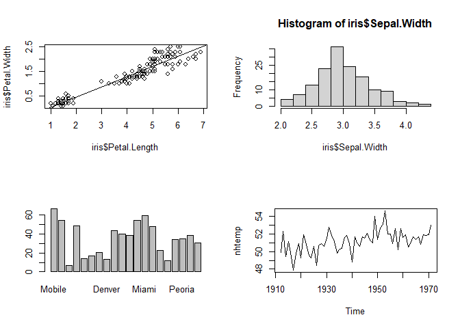<!-- -->

The block of code above demonstrates 4 basic plotting functions in base R:

1. `plot()`, which takes two vectors of data and plots them as x and y points
2. `hist()`, which takes a single vector of data and bins the data to plot the frequency of data in each bin as a histogram. This is also known as plotting the **distribution** of the data. Distributions can also be summarized visually as boxplots (`boxplot()` in base R).
3. `barplot()`, which takes categorical data, that is a named vector or other named data structure, and plots **raw counts** for each category (as opposed to **counts of data in bins** in a histogram).
4. `plot()` again, but this time with time-series data (a vector of points over time), which plots lines connecting the points rather than the points themselves.

While these plots in base R generally look good and convey a lot of information, they aren't perfect. For example, the font size and placement on the x-axis of the barplot in the lower left hand panel mean only a few cities are labeled.

Furthermore, while these basic plots are easy to generate, more complex plots, say plotting two variables on the same panel, become more complicated with the syntax of base R. For these reasons, we will spend the rest of the time learning how to plot using the **ggplot** package. 

### Introduction to ggplot

[ggplot :octicons-link-external-24:](https://ggplot2.tidyverse.org/){:target="_blank"} is a **package** (library of code with various functions) that is part of the **tidyverse**. It uses a somewhat standardized 'grammar of graphics' ([book :octicons-link-external-24:](http://id.lib.harvard.edu/alma/990138412570203941/catalog){:target="_blank"}; [paper :octicons-link-external-24:](https://hollis.harvard.edu/permalink/f/1mdq5o5/TN_cdi_informaworld_taylorfrancis_310_1198_jcgs_2009_07098){:target="_blank"}) in its syntax to make almost every aspect of a plot customizable. Using ggplot it is easy to make reproducible scientific figures that look nice and are easily understandable. With ggplot, I rarely need to tweak my figures outside of R.

This workshop is also heavily influenced by the book [Fundamentals of Data Visualization :octicons-link-external-24:](https://hollis.harvard.edu/permalink/f/1s5nto6/01HVD_ALMA512300276480003941){:target="_blank"} by [Claus Wilke :octicons-link-external-24:](https://clauswilke.com/){:target="_blank"}.

> **Exercise**:
>
> 1. Use the *Packages* tab of the panel in the lower left to install the `cowplot` package. We will use this later on to plot multi-panel figures.
>
> 2. Run the code block below to look at the same plots as above, but using ggplot.


```r
## Load the tidyverse package, which contains ggplot2
library(tidyverse)
## ggplot is part of the tidyverse package

## Load the cowplot package, which works with ggplot objects to combine plots into multi-panel figures
library(cowplot)
## This package works with ggplot objects (graphical objects, or "grobs") to combine plots into multi-panel figures. Make sure you install it before running this code block.

## No need to load the datasets again since we've loaded them above.

## Use ggplot to create a scatter plot with regression line of two variables in the iris dataset
## Save the grob as "scatter" for display later
scatter <- ggplot(iris, aes(x=Petal.Length, y=Petal.Width)) +
  geom_point() +
  geom_smooth(method="lm")

## Use ggplot to create a histogram of a variable in the iris dataset
## Save the grob as "dist" for display later
dist <- ggplot(iris, aes(x=Sepal.Width)) +
  geom_histogram(bins=10)

## Use ggplot to create a barplot of precipitation in US cities
## Note that first we must convert the named vector to a data frame
## Save the grob as "bar" for display later
precip_df <- data.frame(as.list(precip[1:20]))
precip_df <- gather(precip_df)
names(precip_df) <- c("City", "Precipitation")
bar <- ggplot(precip_df, aes(x=City, y=Precipitation)) +
  geom_bar(stat="identity") + 
  theme(axis.text.x=element_text(angle=90, vjust=0.5, hjust=1))

## Use ggplot to crate a line graph of temperature over time
## Note that first we must convert the time series to a data frame
## Save the grob as "line" for display later
nhtemp_df <- data.frame(temp=as.matrix(nhtemp), date=time(nhtemp))
line <- ggplot(nhtemp_df, aes(x=date, y=temp)) +
  geom_line()

## Use plot_grid() to combine the 4 plots simply by listing their variable names
## Set the number of rows and columns in the panel at 2 each
p <- plot_grid(scatter, dist, bar, line, ncol=2, nrow=2)

## Display the multi-panel figure
print(p)
```

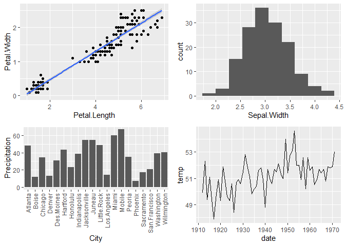<!-- -->

So these plots from ggplot look very similar to the base ones with some minor changes to the style.

Most importantly, ggplot takes as input data **data frames** or **tibbles**, which you learned about earlier.

## Aesthetics and Layers

Next we'll outline the basic syntax of a ggplot plot and introduce two important aspects of them: **aesthetics** and **layers**.

A ggplot starts by defining a graphical object (or **grob**) with the `ggplot()` function and telling it the source of the data for the plot, like this:

```
ggplot(data_frame)
```

So what happens if we do this with the `iris` dataset? 

> Try loading the iris data into a ggplot object called `iris_plot` in the code block below and print it out. What happens?


```r
## Load the iris data into a ggplot grob and display (print) the grob
ggplot(iris)
```

<!-- -->

A blank grey rectangle should appear below the code block. Why?

Well, we've told ggplot the source of the data, but not which parts of the data to use. In ggplot, which data is to be displayed and how it is grouped and colored is referred to as the **aesthetics** of the data, and is defined with the `aes()` function. Each ggplot plot needs at least one column of the input data frame to be designated as the x-axis or y-axis in an `aes()` call in order to know how to plot the data. In many cases, both x and y will be defined, but in some (like for histograms and boxplots) only one is needed.

For example, if I had a data frame called `data_frame` that had two columns called `v1` and `v2` that I wanted to use in ggplot, I would do the following:

```
ggplot(data_frame, aes(x=v1, y=v2))
```

In the code block below, we add the variables `Petal.Length` and `Petal.Width` as the x and y aesthetics of the ggplot with the iris data and display it with `print()`. 

> Run the code block with the added **aesthetics**. What happens?


```r
## Load the iris data into a ggplot grob AND specify the aesthetics and display the grob
iris_plot <- ggplot(iris, aes(x = Petal.Length, y = Petal.Width))

print(iris_plot)
```

<!-- -->

Now you should see a grid on a blank grey rectangle. This time, ggplot knows the data to add to the plot so it appropriately labels the axes, but we still actually haven't told it to plot the data. This is because we need to tell ggplot how to interpret the aesthetics as a graphical representation, i.e. do we want points, lines, bars, etc. We haven't specified yet, so it leaves all the data off. The **layer** we need to add that tells ggplot this information is usually called a **geom** (short for geometry). 

In ggplot, we add **layers** using the plus sign (`+`). Each `+` indicates a new layer in the specified ggplot object and many layers can be added to a single plot in order to display the data in different ways. Every aspect of a plot can be controlled with different layers. 

Each layer itself is a function that can take **arguments** (or **parameters**/**options**) as input within the `()`. For instance, if I wanted to change the size of the points in `geom_point()`, I could type:

```
plot_object <- ggplot(data_frame, aes(x=v1, y=v2)) +
  geom_point(size=2)
```

For a more in depth conceptual overview of how ggplot organizes its layers and the functions for those layers, take a look at Thomas Lin Pedersen's YouTube tutorial that explains the many layers of ggplot. Below is a slide from that tutorial summarizing the minimal set of layers we need to specify to render a graph, which is the say data, a mapping (the aesthetics), and the geometry. Click the slide to be directed to the full video.

[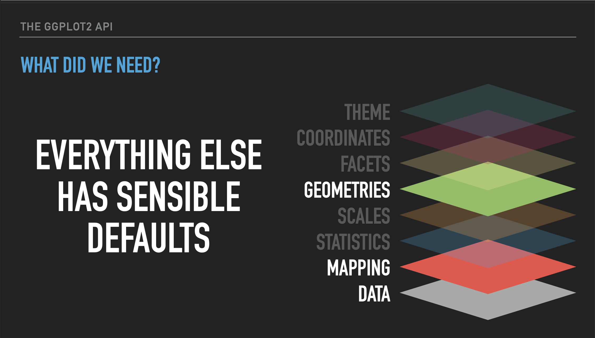](https://www.youtube.com/live/h29g21z0a68){:target="_blank"}

Let's use this information to now plot the **points** for `Petal.Length` and `Petal.Width` that we have specified as aesthetics for the iris data.

> Run the following code block to add a geom_point() layer to the plot of Petal.Length and Petal.Width:


```r
## Load the iris data into a ggplot grob, specify the aesthetics, and
## add a layer that adds the points with geom_point()

iris_plot <- ggplot(iris, aes(x=Petal.Length, y=Petal.Width)) +
  geom_point(size=2, alpha=0.5, color="darkgreen")

print(iris_plot)
```

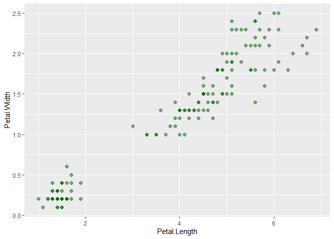<!-- -->

Great! Now we can see our data points on the plot! Now, let's take a couple of minutes to adjust the `geom_point()` layer to do the following:

> **Exercise**:
>
> 1. In the code block above, change the **size** of the points to 2
>
> 2. In the code block above, change the transparency (or **alpha**) of the points to 0.5
>
> 3. In the code block above, change the **color** of the points to **"darkgreen"**

What if we wanted to fit a model that describes the relationship between the x and y variables? For that, ggplot has a **layer** called `geom_smooth()`.

> **Exercise**:
> In the code block below, add anothar **layer** to the plot to fit a model to it with `geom_smooth()`. If you just add `+ geom_smooth()` what happens? Is this a linear regression?


```r
iris_plot_2 <- iris_plot + 
  ### When prompted, add a layer of geom_smooth() here
  geom_smooth(method = "lm", se = FALSE, linetype = "dashed", color = "#333333")
  ### When prompted, add a layer of geom_smooth() here

print(iris_plot_2)
```

```
## `geom_smooth()` using formula = 'y ~ x'
```

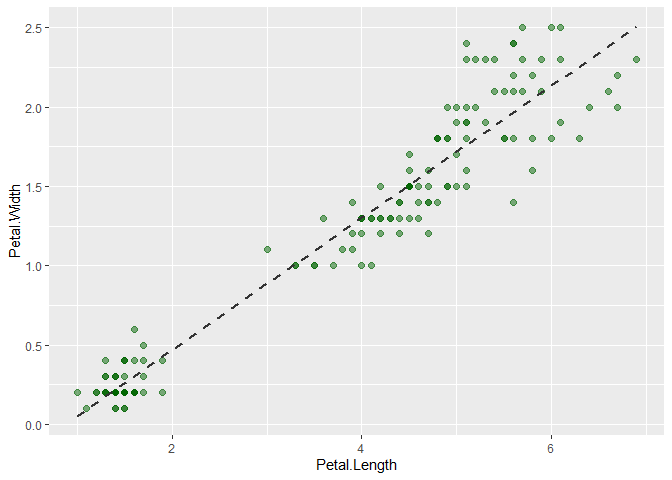<!-- -->
Now make the following changes to the `geom_smooth()` **layer**:

> **Exercise**:
>
> 1. In the code block above, change the **method** of the model fitting to **"lm"** (linear model)
>
> 2. In the code block above, remove the grey confidence interval by setting `se=FALSE`
>
> 3. In the code block above, change the **linetype** to **"dashed"**
>
> 4. In the code block above, change the **color** of the line to the following [hex code :octicons-link-external-24:](https://en.wikipedia.org/wiki/Web_colors#Hex_triplet){:target="_blank"}: `"#333333"`

### Adding new data to a ggplot

So far, we've shown how modular ggplot is with its **layers**, but we've only used these layers with a single **aesthetic** (set of data). Each layer can actually act independently on different aesthetics, simply by specifying the new data set *within the layer* and adding an `aes()` definition to it, like:

```
plot <- ggplot(data_frame, aes(x=v1, y=v2)) +
  geom_point(size=2) +
  geom_point(data=new_data_frame, aes(x=v3, y=v4))
```

As you can see, in the second `geom_point()` layer we have defined a new source of data and subsequently another set of **aesthetics** with `aes()`. In this example, the first `geom_point()` layer will plot variables `v1` and `v2` from the data frame `data` as points on the grid, while the second `geom_point()` layer will plot variables `v3` and `v4` from the `new_data` data frame as points on the grid. Note that it is not always necessary to declare a new data frame if the one originally declared has the data you wish to plot in the new layer as other columns in the data frame.

Let's try this ourselves. 

> **Exercise**:
> In the code block below, add a new `geom_point()` layer to add points that plot `Sepal.Length` and `Sepal.Width` on the same grid as `Petal.Length` and `Petal.Width`:


```r
iris_plot <- ggplot(iris, aes(x=Petal.Length, y=Petal.Width)) +
  geom_point(color="#e69f00") +
  
  ### When prompted, add a new geom_point() layer here with Sepal data
  geom_point(aes(x=Sepal.Length, y=Sepal.Width), color="#56b4e9") +
  
  ### When prompted, add layers that change the labels of the x and y axes here
  xlab("Length") +
  ylab("Width")

## Display the plot
print(iris_plot)
```

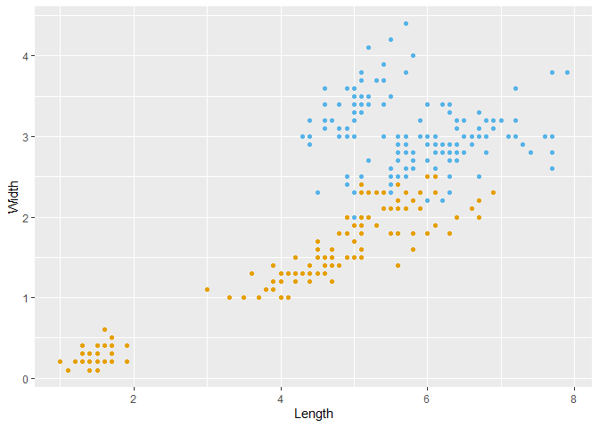<!-- -->

Do you notice any problems with the above plot? Let's try to address them. Edit the code block to do the following:

> **Exercise**:
>
> 1. In the code block above, change the **color** of the `geom_point()` layer that plots Petal.Length and Petal.Width to `"#e69f00"`
>
> 2. In the code block above, change the **color** of the `geom_point()` layer that plots Sepal.Length and Sepal.Width to `"#56b4e9"`
>
> 3. In the code block above, change the x-axis label (**xlab()**) to **"Length"** 
>
> 4. In the code block above, change the y-axis label (**ylab()**) to **"Width"** 

This at least allows us to discern the two different sets of points.

In addition to plotting x and/or y data points, ggplot allows us to **group** data points by a third variable and plot them in distinct ways (e.g. with different colors) in order to visualize them separately. We can do this manually like above, but ggplot does this natively as long as another variable exists in the data frame that indicates the desired groupings.

In order to do that with the iris dataset, we need to make our data a bit tidier. Looking at the data (`View(iris)`), there is actually variable information contained in the columns. Two flower parts were measured for length and width (Sepal and Petal). It would be a bit more tidy if we made *what was measured* itself a variable called "Part". We can do that using the function `pivot_longer()` which can combine column names into a single variable.

> Run the chunk below to see how this works:


```r
iris %>% 
  pivot_longer(cols = !Species, names_sep = "\\.", names_to = c("Part", ".value"))
```

```
## # A tibble: 300 x 4
##    Species Part  Length Width
##    <fct>   <chr>  <dbl> <dbl>
##  1 setosa  Sepal    5.1   3.5
##  2 setosa  Petal    1.4   0.2
##  3 setosa  Sepal    4.9   3  
##  4 setosa  Petal    1.4   0.2
##  5 setosa  Sepal    4.7   3.2
##  6 setosa  Petal    1.3   0.2
##  7 setosa  Sepal    4.6   3.1
##  8 setosa  Petal    1.5   0.2
##  9 setosa  Sepal    5     3.6
## 10 setosa  Petal    1.4   0.2
## # i 290 more rows
```

Note that we've lost some information here, as we now can't associate a particular sepal measurement with a petal. If the only use for this is to plot the scatterplot, then that may be fine. But if we want to, we can fix this by assigning each flower its own ID first. 

> **Exercise**: In the code block below, insert another function before the pivot to assign each flower its own ID. 


```r
iris_part <- iris %>% 
  ## insert function here
  mutate(id = row_number()) %>% 
  pivot_longer(cols = !c(id, Species), names_sep = "\\.", names_to = c("Part", ".value"))

iris_part
```

```
## # A tibble: 300 x 5
##    Species    id Part  Length Width
##    <fct>   <int> <chr>  <dbl> <dbl>
##  1 setosa      1 Sepal    5.1   3.5
##  2 setosa      1 Petal    1.4   0.2
##  3 setosa      2 Sepal    4.9   3  
##  4 setosa      2 Petal    1.4   0.2
##  5 setosa      3 Sepal    4.7   3.2
##  6 setosa      3 Petal    1.3   0.2
##  7 setosa      4 Sepal    4.6   3.1
##  8 setosa      4 Petal    1.5   0.2
##  9 setosa      5 Sepal    5     3.6
## 10 setosa      5 Petal    1.4   0.2
## # i 290 more rows
```

Now we can plot the data with the new variable "Part" as a grouping variable.

>Run the following code to see how ggplot automatically handles the data.


```r
iris_plot <- ggplot(iris_part, aes(x = Length, y = Width, color = Part)) +
  geom_point() +
  ### when prompted, insert code to change colors and legend
  scale_color_manual(values = c(Petal = "#e69f00", Sepal = "#56b4e9"), name = "Flower Part", labels = c(Petal = "Petals!", Sepal = "Sepals!"))

print(iris_plot)
```

<!-- -->

As you can see, by changing the way our data is formatted, the axis labels are pulled directly from our new variable names "Length" and "Width", the legend title was auto-generated from our variable name "Part", and the color labels were pulled from the distinct categories within "Part". We will revisit this concept of grouping in another section of this workshop. 

What if we want to change the colors or the names of the labels in the legend? There's another layer family called the **scale** which are usually formatted like `scale_[aesthetic type]_[variable type]` which will modify different aspects of the plot. For instance, in this case we'll use `scale_color_manual()`, which allows us to manually specify the color attribute of the plot. 

> **Exercise**: 
> 
> 1. In the code block above, add a layer `scale_color_manual(values = c(Petal = "#e69f00", Sepal = "#56b4e9"))` to change the colors of the points.
>
> 2. Within the `scale_color_manual()` function, use the `name = ` parameter to change the legend title to **"Flower Part"**
>
> 3. Within the `scale_color_manual()` function, insert `labels = c(Petal = "Petals!", Sepal = "Sepals!")` to give more excitement to your legend labels. 

This is something non-intuitive about ggplot: To change aspects of the graph that are linked to the data, such as the legend colors and labels, ggplot uses **scale** functions. To change the look of something that is unrelated to the data, like font, background color, etc, ggplot uses **themes**. This is all part of a **grammar of graphics** that underlies the programming of the ggplot package. We will briefly go over scales and themes at the end of this workshop. 

### Saving ggplots

Now that we've made a pretty ggplot with tidy code, how do we save it to share with others? There are a few ways. 

The first way - if you've been working on your project in an rmarkdown document - you don't have to do anything! You can `knit` the rmarkdown document into HTML and share all the text, code, and images, without changing a thing. 

The second way is to use the RStudio GUI. Open the panel on the lower right containing the tabs Files/Plots/Packages/Help/ etc tabs and click on the plots tab. Then copy and paste the code you used to generate the plot (or in our case just the name of the object `iris_plot`) into the console, and the plot will show up there. Then, you can click the export button and save the plot. This is great if you want to throw something into powerpoint or share on slack/email with a collaborator your intermediate results. 

However, if you want to save a plot for publication and then also intend to publish the code used to generate that plot, the best practice is to use an R Script, copy and paste all (and only) the code you used to generate the final plot, save it, and then use the `ggsave()` function to export your plot. Open a new R script now and copy ALL the code you used to generate the latest plot. This includes importing the tidyverse and datasets package, transforming the iris data, and of course the plotting code itself. Then, use `ggsave()` to save the plot using the default parameters.

> **Exercise**: Open a new R script (should have a .R extension) to reproduce the iris plot we just made in the last code chunk by copy and pasting the necessary code. Then, use `ggsave()` to save the plot using the default parameters. To really check that your code is standalone, **clear your environment** and run the script. If it works, you're good to go!

------

## More ggplot examples with macaque structural variants

For the next portion of the workshop, we'll be constructing some more basic types of plots with ggplot, but this time with a genomic dataset that will need additional filtering and manipulation using **tidyverse**.

Specifically, the data we'll be looking at are structural variants in a small population of rhesus macaques. Rhesus macaques are small, Old-World monkeys that are widespread across southern and eastern Asia. They are a common model organism for the study of human disease and primate evolution. [We sequenced these genomes to study the evolution structural variation over different timescales :octicons-link-external-24:](https://doi.org/10.1093/molbev/msaa303){:target="_blank"}
.

We've provided the location in the reference macaque genome of the structural variants in our population of macaques in a tab-delimited file that contains genomic intervals (commonly known as a bed file).

> Run the following code block to read the file containing the macaque structural variant calls (SVs) into our R environment as a data frame and take a look at a few lines of the data:


```r
## Read the data containing macaque SV calls as a data frame
macaque_svs <- read_tsv("https://harvardinformatics.github.io/workshops/2023-fall/r/data/macaque-svs-filtered.bed", col_names=c("chr", "start", "end", "sv"))

## Display the data frame
macaque_svs
```

```
## # A tibble: 3,646 x 4
##    chr    start    end sv                             
##    <chr>  <dbl>  <dbl> <chr>                          
##  1 chr1   89943  90471 chr1:89943:<DUP>:528:1907.19   
##  2 chr1  130740 131675 chr1:130740:<DEL>:935:285.63   
##  3 chr1  218574 219534 chr1:218574:<DUP>:960:5699.01  
##  4 chr1  219608 220078 chr1:219608:<DUP>:470:2074.69  
##  5 chr1  519434 541582 chr1:519434:<DUP>:22148:1673.64
##  6 chr1  519473 542033 chr1:519473:<DUP>:22560:2560.16
##  7 chr1  520173 541800 chr1:520173:<DEL>:21627:2955.11
##  8 chr1  525401 525806 chr1:525401:<DEL>:405:2986.21  
##  9 chr1  541132 590572 chr1:541132:<DEL>:49440:316.41 
## 10 chr1  552968 582234 chr1:552968:<DUP>:29266:189.32 
## # i 3,636 more rows
```

This shows a relatively simply structured dataset, with the first column indicating the chromosome on which the structural variant is located, the second showing the starting coordinate on that chromosome, and the third showing the end coordinate. These three columns are typical of a bed file. The fourth column is a bit of a catchall (like many last columns in bioinformatics file formats are) that provides an attempt to give a unique ID for each structural variant. We'll talk about this column more in a bit, but do note that within this column we see the TYPE of structural variant coded as **<DUP>** for duplication and **<DEL>** for deletion.

> **Exercise**:
> How many chromosomes do macaques have?

## Visualizing the **shape** of the distribution of macaque SV lengths with a *histogram*

Let's first look at the shape of the distribution of SV lengths in our dataset using a histogram. Histograms take a set of data and partition them into **bins**. The number of data points in each bin is then counted and a bar with a height representing that count is placed at that bin's label.

To make a histogram of lengths we'll first need to **add a column with the length of each SV to the dataset**.

> **Exercise**:
> In the code block below, use `mutate()` to add the length of each SV as another column in the macaque_svs data frame. Call this column `length`. What is the average length of all structural variants in the dataset?


```r
### When prompted, add a column to the macaque_svs data frame that contains the length of each SV
### Call this column 'length'
macaque_svs <- macaque_svs %>% mutate(length = end - start)

mean(macaque_svs$length)
```

```
## [1] 3615.021
```

Now, let's make a histogram to visualize the shape of the distribution of lengths.

> Run the following block of code to visualize the distribution of SV lengths as a histogram:


```r
sv_len_hist <- macaque_svs %>% 
  
  ### when prompted add a function here to replace any SV with length > 5000 with 5000
  mutate(length = replace(length, length > 5000, 5000)) %>% 
  
  ggplot(aes(x=length)) +
    ### when prompted, change the histogram color and bin number here
    geom_histogram(color="#999999")

## Display the plot
print(sv_len_hist)
```

```
## `stat_bin()` using `bins = 30`. Pick better value with `binwidth`.
```

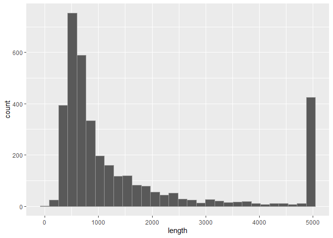<!-- -->

What are some things we see about this distribution? 

By default, `geom_histogram()` partitions the data into 30 **bins**, however we can customize this with the `bins=` option within that layer.

> **Exercise**:
>
> 1. In the block of code above, change the number of bins in the histogram above. How does this change how we view the distribution?

### Binning outliers

In order to more accurately see the shape of the distribution, use **mutate** to replace any SV with a length > 5000 with 5000. Be careful not to change the original data! Hint - the `replace()` function takes a vector, a logical index, and a value to replace. So `replace(length, length > 5000, 5000)` replaces every value of the first vector where the second argument is `TRUE` with the third argument. 

> **Exercise**:
>
> 2. In the block of code above, add a line using the `mutate()` function to replace SVs shorter than 5000bp from the `macaque_svs` data frame with a value of 5000 and re-generate the plot.

Now we can see that most of the SVs are shorter than 2000bp and many are even shorter than 1000bp.

> **Exercise**:
>
> 3. I also like to see the boundaries between the histogram bins (bars). Add a `color=` to the histogram layer to see them.

### Adding lines to existing plots

In addition to **layers** like `geom_line()`, which requires x and y coordinates, there are also **layers** like `geom_hline()`, `geom_vline()`, and `geom_abline()` that let us add horizontal, vertical, and custom lines to the plot. Let's add a **layer** that shows a vertical line at the average SV size using `geom_vline()` as follows. You'll need to define the mean first, since we want to exclude outliers (SVs > 5000 bp) from the mean calculation. 

> **Exercise**:
>
> 1. In the chunk below, filter out the outliers >5000 and calculate the mean SV length in the macaque dataset and stored it as an object called `mean_sv_len`. 
>
> 2. Add the layer `geom_vline(xintercept=mean_sv_len)` to the `sv_len_hist` object in the code block below and re-generate the plot. Customize the look of the line any way you want (e.g. with `color=`, `linetype=`, `linewidth=`, etc.)
>
> 3. Once you like how it looks, assign it to the object `sv_len_hist` to move on to the next code chunk


```r
### When prompted, calculate the mean SV length as mean_sv_len
mean_sv_len <- macaque_svs %>% filter(length <= 5000) %>% pull(length) %>% mean()
### When prompted, calculated the mean SV length as mean_sv_len

sv_len_hist_2 <- sv_len_hist + 
  ### When prompted, add a layer with geom_vline() at the mean SV length
  geom_vline(xintercept=mean_sv_len, linewidth=1, linetype="dotted", color="black")

print(sv_len_hist_2)
```

```
## `stat_bin()` using `bins = 30`. Pick better value with `binwidth`.
```

<!-- -->

### Adding text to plots

We can also add text as a layer to the plot. If we had text to add for every point, we may use something like `geom_text()` or `geom_label()` to layer it on. However, for now let's add only one bit of text to this plot: the average SV length, next to the line we added. To do this, we can use an `annotate()` layer and directly provide the text and the x and y coordinates at which to display it. This can take a little trial and error to get right, so I've already put it in the right spot (for my display). 

> Add this layer to the `sv_len_hist` object in the code below and re-generate the plot:

```
annotate("text", x=mean_sv_len+300, y=600, label=signif(mean_sv_len, 6))
```


```r
sv_len_hist +
    ### When prompted, add a layer with annotate() to display the mean SV length
    annotate("text", x=mean_sv_len+300, y=600, label=signif(mean_sv_len, 6)) +
    ### when prompted, change the spacing of the bars using scale_y_continuous()
    scale_y_continuous(expand=c(0,0)) + 
    ### when prompted, add a label for the y axis
    ylab("## of Structural Variants")
```

```
## `stat_bin()` using `bins = 30`. Pick better value with `binwidth`.
```

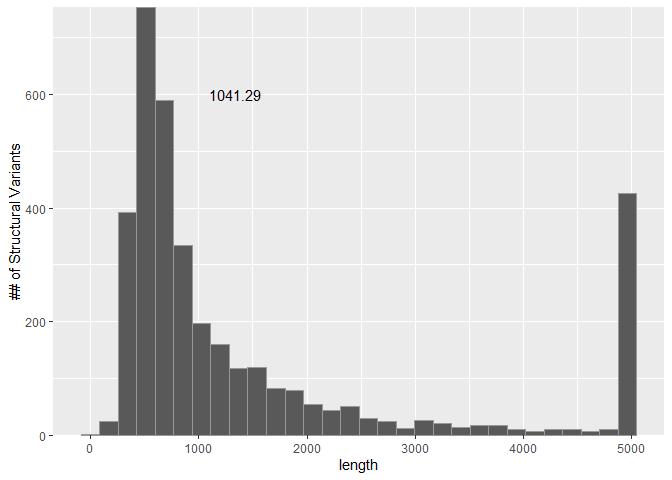<!-- -->

### Other aspects of the plot

There are some other things we can do to improve this plot:

> **Exercise**:
>
> 1. I personally dislike the space between the bars of the histogram and the x-axis. We can remove this by changing the y-axis. Add the following **layer** to the histogram above to do so: `scale_y_continuous(expand=c(0,0))`
>
> 2. Provide a more descriptive y-axis label with a `ylab()` layer.


## **Summarizing** the distribution of SV lengths with a *boxplot*

The histogram allows us to clearly see the shape of the distribution of interest, and we've added some nice annotations to the plot. But the best way to *summarize* a distribution is with a boxplot. Boxplots are also a good way to visualize shifts in multiple distributions, since they can easily be placed next to each other, unlike a histogram which uses both axes to plot data. In this case, let's filter out the SVs longer than 5000 bp first, using the `filter` function. 

> Generate the boxplot of SV lengths in the code block below:


```r
sv_len_boxplot <- macaque_svs %>% 
  filter(length <= 5000) %>% 
  ## To prevent the box from spanning the width of the grid we specify x=0 in the aesthetics and set the limits to the x-axis here
  ggplot(aes(x=0, y=length)) +
    geom_boxplot(width=0.5) +
    scale_x_continuous(limits=c(-1,1)) +
    ### When prompted, add a layer with geom_point() that shows a single point at the mean SV length
    geom_point(aes(x=0, y=mean(length)), size=3, color="blue")

## Display the plot
print(sv_len_boxplot)
```

```
## Warning in geom_point(aes(x = 0, y = mean(length)), size = 3, color = "blue"): All aesthetics have length 1, but the data has 3227 rows.
## i Please consider using `annotate()` or provide this layer with data containing
##   a single row.
```

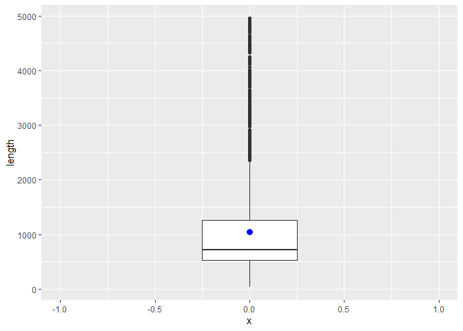<!-- -->

The boxplot shows the median length as the line in the box, the first and third quartiles as the top and bottom of the box, respectively, and the min and max values (excluding outliers) at the end of the line. With so many outliers, my guess is that the mean SV lengths is larger than the median. Let's add a `geom_point()` **layer** with a single point for the mean SV length. This is similar to adding the line to the histogram, but slightly more complicated for a couple of reasons:

1. The x-axis is a meaningless continuous scale in this case.
2. We're adding a single point that doesn't exist in a data frame, so we'll have to provide an empty data frame to do so.

> Add the following **layer** to the boxplot in the code block above to add a point for the mean SV length:

```
geom_point(aes(x=0, y=mean(length)), size=3, color="blue")
```

Notice that this time we didn't have to separately calculate the mean for the boxplot. Instead, we passed a function to the `y=` aesthetic that calculates the mean of the `length` column for each boxplot. We also didn't specify a `data=` option because the data has been **inherited** from the original call to `ggplot()`. By default, when you create a new layer, **both the data and the aesthetics** are inherited. In our case, we used to inherited data to make a new set of aesthetics. 


## Plotting categorical/discrete variables in ggplots

Let's say we want to know if the length of **deletions** differs from that of **duplications**. What kind of plot would help answer that question? Perhaps two boxplots side by side, one for deletions and one for duplications. In order to do this, we first need to create a column or variable that can tell us what type of SV each row of our data represents. Recall that the fourth column of our data encodes a lot of information about the SV in a string separated by colons. Some of this is redundant with information we already have, but some of it is unique and useful. Specifically, in the 4th column we have:

```
chromosome:start coordinate:SV type:length:score
```

So this has the information we want (SV type), but not in a format that is easy to group by since the whole string is unique to that row right now. To get this information out we can use the `separate()` function to extract the part of the string we want (SV type) and then put it into a new column called "type". The code block below shows how we can use `separate()` to add columns to our data based on strings in existing columns and an example of how to plot the distributions of the length of these two types of SVs. We'll also filter out SVs longer than 5000 bp.

> Run the code block below to separate the information in the 4th column of our data frame into individual columns of interest:


```r
macaque_svs_sep <- macaque_svs %>% 
  ## filter out SVs longer than 5000 bp
  filter(length <= 5000) %>%
  ## Separate the information in the sv column of macaque_svs intro separate columns
  ## - Split whenever a colon (:) is seen
  ## - Keep only the third and fifth splits, and name the new columns "type" and "score". Do not remove original column.
  separate(sv, c(NA, NA, "type", NA, "score"), sep=":", remove=FALSE)

macaque_svs_sep
```

```
## # A tibble: 3,227 x 7
##    chr     start     end sv                               type  score    length
##    <chr>   <dbl>   <dbl> <chr>                            <chr> <chr>     <dbl>
##  1 chr1    89943   90471 chr1:89943:<DUP>:528:1907.19     <DUP> 1907.19     528
##  2 chr1   130740  131675 chr1:130740:<DEL>:935:285.63     <DEL> 285.63      935
##  3 chr1   218574  219534 chr1:218574:<DUP>:960:5699.01    <DUP> 5699.01     960
##  4 chr1   219608  220078 chr1:219608:<DUP>:470:2074.69    <DUP> 2074.69     470
##  5 chr1   525401  525806 chr1:525401:<DEL>:405:2986.21    <DEL> 2986.21     405
##  6 chr1   766381  766933 chr1:766381:<DEL>:552:5099.0     <DEL> 5099.0      552
##  7 chr1  1117696 1122022 chr1:1117696:<DEL>:4326:201.55   <DEL> 201.55     4326
##  8 chr1  1151866 1154542 chr1:1151866:<DEL>:2676:11284.32 <DEL> 11284.32   2676
##  9 chr1  1166390 1167586 chr1:1166390:<DEL>:1196:15253.03 <DEL> 15253.03   1196
## 10 chr1  1408621 1409766 chr1:1408621:<DEL>:1145:1112.53  <DEL> 1112.53    1145
## # i 3,217 more rows
```

So we can see that there are now two more columns in our data frame: **type**, which tells us whether the SV is a deletion (\<DEL\>) or duplication (\<DUP\>), and **score** which is just how the program that inferred the SVs scored the call.

> **Exercise**: Use the function `str_replace_all()` to remove the "<" and ">" characters from the `type` column.


```r
## Hint 1: Use the ? command in the console to bring up the documentation page for this new function
## Hint 2: You can use logical operations like | (or) in the string you input to the pattern argument. What should you replace it with if you want to remove the pattern?
## Hint 3: You can use $ get at the type column or use mutate()

macaque_svs_sep <- macaque_svs_sep %>% 
  mutate(type = str_replace_all(string = type, pattern = "<|>", replacement = ""))
```

Now that we have this information, we want to construct a boxplot with ggplot that uses this new data to summarize the distribution of **length** of the SVs and group the SVs on the x-axis by **type**. In the case of a boxplot, we simply **add the type variable as the x aesthetic**.

> Run the code block below to generate boxplots summarizing the distribution of SV lengths for both types of SVs:


```r
## Piping the macaque SV data with SV type as a column to ggplot to 
## generate boxplots of SV length by type
macaque_svs_sep %>% 
  ggplot(aes(x=type, y=length)) +
    geom_boxplot(width=0.5) +
    theme(axis.text.x=element_text(angle=25, hjust=1))
```

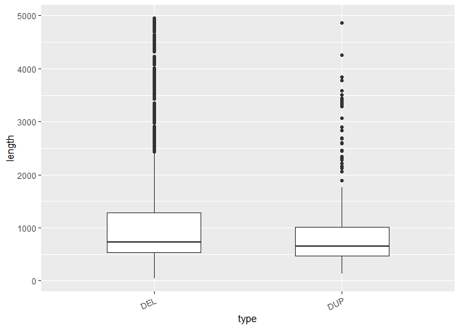<!-- -->

The `geom_boxplot()` function automatically draws a boxplot with a horizontal line at the median and the and hinges corresponding to the first and third quartiles (25th and 75th percentiles). The whiskers extend 1.5*IQR from the hinge and the points outside of that are deemed outliers. Keep in mind that these are statistics ggplot has by default generated for you, and may be different than what you expect so always read the docs! 

### Grouping and summarizing when plotting

What other discrete variables are in the dataset? What about chromosome? Let generate a boxplot where the x-axis is the chromosome and the y-axis is the SV length. 

> Run the code block below to generate a plot with multiple boxplots, 1 per chromosome:


```r
sv_len_boxplot <- macaque_svs_sep %>% 
  ggplot(aes(x=chr, y=length)) +
    geom_boxplot(width=0.5) +
    ## This theme layer adjusts the angle of the labels on the x-axis - we'll learn more about theme() later
    theme(axis.text.x=element_text(angle=25, hjust=1))


## Display the plot
print(sv_len_boxplot)
```

<!-- -->

In the boxplot above, it would be nice to visualize the mean SV length at the same time as we may be interested in the skew of this distribution. Previously in out tidyverse workshop, we showed that we can use the `group_by()` and `summarise()` functions to generate custom summary statistics about out data. Both of these functions return tibbles, which can be used as another data layer in ggplot. First, let's review how to use these functions. 

>**Exercise**
>
> 1. In the code block below, generate a summary tibble containing one value for the total number of chromosomes (name that variable "n") and one value for the average SV length of all SVs (name that variable "mean_len"):


```r
## Hint: start with macaque_svs_sep and %>% it into a summarize function which contains the two statistics we want
macaque_svs_sep %>% 
  ## Enter your summarize command here
  summarize(n=n_distinct(chr), mean_len=mean(length, na.rm=TRUE))
```

```
## # A tibble: 1 x 2
##       n mean_len
##   <int>    <dbl>
## 1    22    1041.
```

> 2. In the code block below, group the `macaque_svs_sep` by chromosome and calculate the number of SVs (call it "n_svs") per chromosome as well as the mean SV length (call it "mean_len") per chromosome. Save this one as macaque_svs_chr.


```r
## Hint: you tibble result should have three columns ["chr", "n_svs", "mean_len"]
macaque_svs_chr <- macaque_svs_sep %>% 
  ## Enter your combined group_by() and summarise() command here
  group_by(chr) %>% 
  summarise(n_svs = n_distinct(sv), mean_len = mean(length, na.rm=TRUE))

print(macaque_svs_chr)
```

```
## # A tibble: 22 x 3
##    chr   n_svs mean_len
##    <chr> <int>    <dbl>
##  1 chr1    216    1085.
##  2 chr10   135     912.
##  3 chr11   140     948.
##  4 chr12   151    1016.
##  5 chr13   141     974.
##  6 chr14   128    1061.
##  7 chr15   132     932.
##  8 chr16   110     886.
##  9 chr17   153     970.
## 10 chr18    84    1138.
## # i 12 more rows
```

Now we can add another layer to our boxplot. Let's visualize the mean as a blue dot. What type of geom will we need to add?

> 3. Add a new layer to `sv_len_boxplot` using our new tibble that visualizes the mean SV length for each chromosome as a blue dot 


```r
## Hint: you will need to re-specify the data and aes within the geom
sv_len_boxplot +
  ## Enter your new layer here
  geom_point(data=macaque_svs_chr, aes(x=chr, y=mean_len), color="blue") 
```

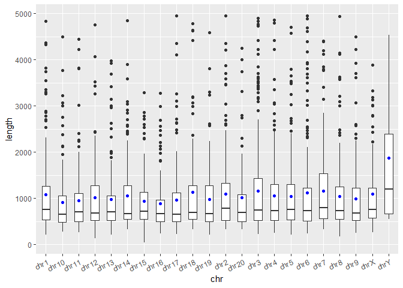<!-- -->

### Violin plots: Visualizing the shape AND summary of a distribution

So far we've used **histograms** to look at the shape of distributions and **boxplots** to summarize them. But we can do both in a single visualization. There are many ways to do this, but one way is to use a **violin plot** with `geom_violin()` in combination with `geom_boxplot()`. Violin plots are similar to **density** plots, but flipped on their side and mirrored.

> Run the code block below to take the distributions of SV length for DELs and DUPs that we created above and convert it into a violin plot:


```r
## Construct a violin plot with boxplot to summarize and show shape of SV length distributions by type
sv_len_violin_type <- ggplot(macaque_svs_sep, aes(x=type, y=length)) +
  geom_violin() +
  
  ### Uncomment when prompted
  geom_boxplot(width=0.1, outlier.shape=NA) +
  ### Uncomment when prompted
  
  theme(axis.text.x=element_text(angle=25, hjust=1))

## Display the plot
print(sv_len_violin_type)
```

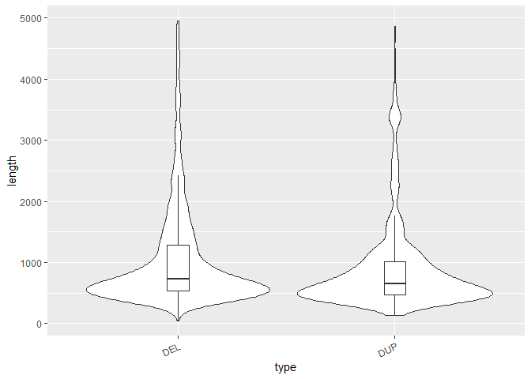<!-- -->

This is an interesting way to show the shape of each distribution next to each other. But we can also summarize the distribution as well with a boxplot to give us even more information that's easy to understand within this single plot.

> In the code block above, uncomment the line that adds the boxplot to see both the shape and the summary of the distribution.

### Comparing sums or counts with bar plots

Another basic type of plot that is useful for comparing cumulative counts, amounts, or sums is the **barplot**. 

> Run the code block below to make a barplot of the total count of SVs per chromosome:


```r
## A barplot of the counts of SVs per chromosome
sv_count_bar_chr <- ggplot(macaque_svs_sep, aes(x=chr)) +
  geom_bar(stat="count") +
  theme(axis.text.x=element_text(angle=25, hjust=1))

## Display the plot
print(sv_count_bar_chr)
```

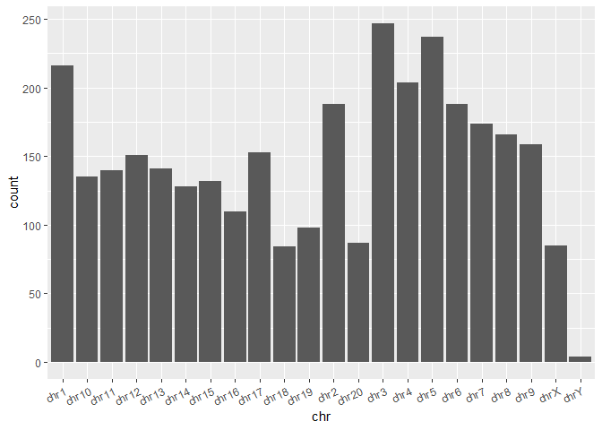<!-- -->

From this we can easily see differences in the number of SVs per chromosome. Notice that even though we provided the whole data frame, which doesn't contain counts per chromosome, we've been able to summarize by count within the ggplot call itself by using the `stat="count"` parameter in the `geom_bar()` layer.

### Ordering categorical variables automatically (Factors)

A way to make this look nicer would be to order the bars by counts so that the bars with the highest counts appear first when reading the plot from left to right. In order to do this we can use the `fct_infreq()` function from the [forcats :octicons-link-external-24:](https://forcats.tidyverse.org/index.html){:target="_blank"}
 package. This package is all about reordering **factors** which are how R handles categorical variables. In R when a categorical variable is a factor, it has something called **levels** which delineates **all possible values** as well as the **ordering**.

Observe the output of the `fct_infreq()` function in the two code chunks below, one before passing it through the function and one after. The function converts it into a factor, as seen by the appearance of another line at the end of the output starting with "22 Levels". And the order of the chr within the "Levels" is ordered by frequency.

> Run the next two code blocks and compare the output


```r
## this code chunk is set to only print the first 50 items of the vector to save space
print(macaque_svs_sep$chr[0:50])
```

```
##  [1] "chr1" "chr1" "chr1" "chr1" "chr1" "chr1" "chr1" "chr1" "chr1" "chr1"
## [11] "chr1" "chr1" "chr1" "chr1" "chr1" "chr1" "chr1" "chr1" "chr1" "chr1"
## [21] "chr1" "chr1" "chr1" "chr1" "chr1" "chr1" "chr1" "chr1" "chr1" "chr1"
## [31] "chr1" "chr1" "chr1" "chr1" "chr1" "chr1" "chr1" "chr1" "chr1" "chr1"
## [41] "chr1" "chr1" "chr1" "chr1" "chr1" "chr1" "chr1" "chr1" "chr1" "chr1"
```


```r
## this code chunk is set to only print the first 50 items of the vector to save space
print(fct_infreq(macaque_svs_sep$chr))
```

```
##  [1] chr1 chr1 chr1 chr1 chr1 chr1 chr1 chr1 chr1 chr1 chr1 chr1 chr1 chr1 chr1
## [16] chr1 chr1 chr1 chr1 chr1 chr1 chr1 chr1 chr1 chr1 chr1 chr1 chr1 chr1 chr1
## [31] chr1 chr1 chr1 chr1 chr1 chr1 chr1 chr1 chr1 chr1 chr1 chr1 chr1 chr1 chr1
## [46] chr1 chr1 chr1 chr1 chr1
##  [ reached getOption("max.print") -- omitted 3177 entries ]
## 22 Levels: chr3 chr5 chr1 chr4 chr2 chr6 chr7 chr8 chr9 chr17 chr12 ... chrY
```

When a factor is input into a plotting function (ggplot or base R), the ordering denoted by the "Levels" is automatically reflected in the resulting plot. 

> Run the code block below to re-order the bars in the barplot from most SVs to least SVs (highest bars to lowest bars):


```r
ggplot(macaque_svs_sep, aes(x = fct_infreq(chr))) + 
  geom_bar(stat = "count") +
  theme(axis.text.x = element_text(angle=25, hjust=1))
```

<!-- -->

> **Exercise** Let's pretend we never knew about the forcats package or that handy function, but we do know about base R's `reorder()` function, which is a base R function that also turns your vector into a factor. How would we make the same graph as above? This will take two steps.


```r
## Summarize the counts by chromosome in a new data frame
macaque_svs_chr_count <- macaque_svs_sep %>% 
  group_by(chr) %>% 
  mutate(count=n())

## Re-order by count when we define the aesthetics
ggplot(macaque_svs_chr_count, aes(x=reorder(chr,-count))) +
  geom_bar(stat="count") +
  theme(axis.text.x=element_text(angle=25, hjust=1))
```

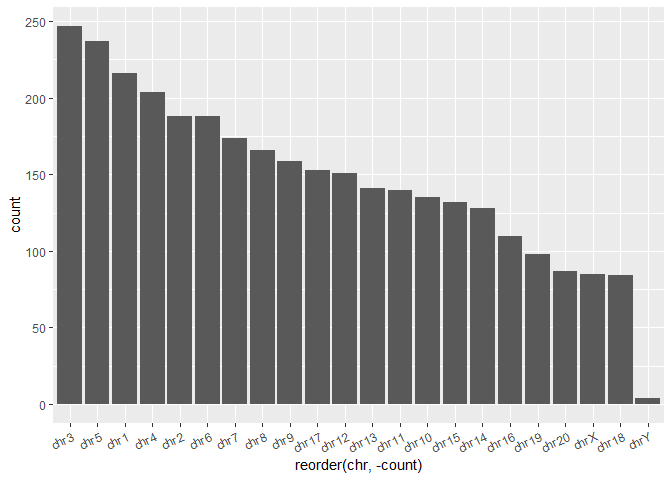<!-- -->

### Ordering categorical variables manually

One may also want to instead order by chromosome number. This is slightly more difficult because we can't use a built-in R function like `reorder()` -- the chromosomes, being a mix of characters and integers, are already sorted in terms of alphabetical order (i.e. chr1 followed by chr10 instead of chr2). Instead, we will have to manually convert the `chr` column to a factor and specify the orders of the levels.

> Run the code block below to re-order the bars by chromosome number


```r
macaque_svs_sep <- macaque_svs_sep %>% 
  ## Convert the chr column from to a factor and order the levels of the factor manually
  ## This ordering will be reflected in the orders of the bars when plotted
  mutate(chr = factor(chr, levels=c("chr1", "chr2", "chr3", "chr4", "chr5", "chr6", "chr7", "chr8", "chr9", "chr10", "chr11", "chr12", "chr13", "chr14", "chr15", "chr16", "chr17", "chr18", "chr19", "chr20", "chrX", "chrY")))

## A barplot of the counts of SVs per chromosome
sv_count_bar_chr_ordered <- ggplot(macaque_svs_sep, aes(x=chr, fill=type)) +
  geom_bar(stat="count", color="#333333") +
  theme(axis.text.x=element_text(angle=25, hjust=1))

## Display the plot
print(sv_count_bar_chr_ordered)
```

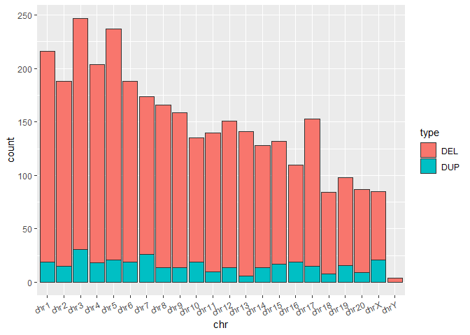<!-- -->

## Stacked bar plots and a brief intro to colors

Again, it may be useful to visualize multiple aspects of our data by grouping different variables. With barplots there are two ways to do this, either by **stacking** bars for different groups or by **dodging** bars (placing bars for different groups next to each other). `geom_bar()`'s default behavior when given a grouping variable is to **stack** the bars.

> **Exercise**:
>
> 1. In the code block above, add a `color=type` parameter to the **aesthetic** in order to divide each bar by SV type.

What happens? We've created a **stacked** barplot where the bar is split proportionally by a third variable - in this case `type`. The outlines of of the boxplot are now colored by the type of SV, but the middle is still gray, making it a pretty ugly plot. 

ggplot aesthetics usually have two ways to be colored, either with `color=` or `fill=`. **color** refers to the color of the line that defines the border of a shape while **fill** refers to the color of the inside of the shape. Let's see the difference and see how stacked bar plots look:

> 2. In the code block above, replace `color=type` with `fill=type` in the **aesthetics** of the barplot above. 

What happens? Now we can see a difference between the two types of SV calls for each chromosome, though not very distinctly.

> 3. In the code block above, both `fill` and `color` can be defined for a given aesthetic. Add `color="#333333"` **to the `geom_bar()` layer of the barplot** to see. By adding this to the **geom** rather than the **aesthetics** we have specified to color all bars the same way, regardless of grouping.

### Comparing proportions using stacked bar plots

We can also use stacked barplots to compare proportions of amounts in groups. One simply has to make a single adjustment, in which one specifies `position="fill"`. It does seem a bit odd to specify one of the dimensions of the mapping definition *fill* in quotes ... but it results in some ggplot magic!

> Run the code block below to show the same bar plot now expressed as proportions


```r
sv_count_bar_chr_prop <- ggplot(macaque_svs_sep, aes(x=chr, fill=type)) + 
  geom_bar(position="fill", color="#333333") + 
  theme(axis.text.x=element_text(angle=25, hjust=1)) + 
  
  ### When prompted, add a horizontal line at y = 0.10 with geom_hline()
  geom_hline(yintercept=0.10, linetype="dotted", color="#333333") +
  ### When prompted, add a horizontal line at y = 0.10 with geom_hline()

  theme(axis.text.x=element_text(angle=25, hjust=1))

print(sv_count_bar_chr_prop)
```

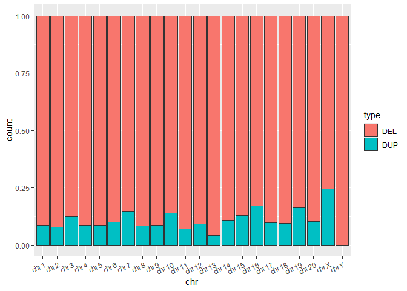<!-- -->

Here we can see that the SVs from this macaque sample are predominantly deletions. But how extreme is this? 

> **Exercise**:
> In the code block above add a horizontal line at y = 0.10 with `geom_hline()` to see how many chromosomes are over 90% deletions.

**Bonus exercise**

> **Exercise**:
> In the code block below, re-write all of the commands leading up to generating the bar plot in the code block named `sv-count-barplot-chr-prop` as a single piped command. This command should do the following:
>
> 1. Read the data from a file
>
> 2. Add a column representing the length of each SV
>
> 3. Filter out SVs longer than 5000bp or on the X or Y chromosomes
>
> 4. Separates the SV column to add a column of SV type
>
> 5. Remove nuisance characters < and > from SV type values
>
> 6. Makes chr column into a factor sorted alphabetically or by frequency
>
> 7. Plots a stacked barplot of the number of SVs grouped by chr and split by type

> 8. add a horizontal line at y = 0.10 with geom_hline()
>
> Don't save any data to named objects (not necessarily best practice for readability, but a good exercise in piping!). 


```r
### Write a single command to do all the steps to generate the barplot above without saving any objects

## Read the data from a file
read_tsv("https://harvardinformatics.github.io/workshops/2023-fall/r/data/macaque-svs-filtered.bed", col_names=c("chr", "start", "end", "sv")) %>% 
  
  ## Add a column representing the length of each SV
  mutate(length=end-start) %>%
  ## Filter out SVs longer than 5000bp or on the X or Y chromosomes
  filter(length < 5000 & !chr == "chrX" & !chr == "chrY") %>%
  ## Separate the SV column to add a column of SV type
  separate(sv, c(NA, NA, "type", NA, "score"), sep=":", remove=FALSE) %>%
  ## remove < and > characters
  mutate(type = str_replace_all(string = type, pattern = "<|>", replacement = "")) %>%
  ## Make chr column into a factor sorted alphabetically or by frequency
    mutate(chr = factor(chr, levels=c("chr1", "chr2", "chr3", "chr4", "chr5", "chr6", "chr7", "chr8", "chr9", "chr10", "chr11", "chr12", "chr13", "chr14", "chr15", "chr16", "chr17", "chr18", "chr19", "chr20", "chrX", "chrY"))) %>%
  ## Plot a stacked barplot of the number of SVs grouped by chr and filled by type
  ggplot(aes(x=chr, fill=type)) +
    geom_bar(position="fill") +
    theme(axis.text.x=element_text(angle=25, hjust=1)) +
  ## add a horizontal line at y = 0.10 with geom_hline()
  geom_hline(yintercept=0.10, linetype="dotted", color="#333333")
```

```
## Rows: 3646 Columns: 4
## -- Column specification --------------------------------------------------------
## Delimiter: "\t"
## chr (2): chr, sv
## dbl (2): start, end
## 
## i Use `spec()` to retrieve the full column specification for this data.
## i Specify the column types or set `show_col_types = FALSE` to quiet this message.
```

<!-- -->

------

## Making prettier plots

There is a lot of material to discuss about plotting. We've covered most of the important stuff on how to get data into different types of plots. But now let's discuss additional ways we can customize and manipulate ggplot objects.

### Facetting

ggplot also provides an easy way to compare groups in different panels called **facetting**. `facet_wrap()` and `facet_grid()` allow you to split your plot into multiple panels by another group variable. Note that this way of creating a multi-panel figure is quite different from the `plot_grid()` function we demonstrated at the beginning of this workshop. `plot_grid()` aggregates plots generated by separate ggplots into multiple panels, which typically are comprised of *different* (if related) data. In contrast `facet_wrap()`, splits the *same* overall data set into facets based upon grouping variables that subdivide the data so you can compare and contrast patterns in different groups (or pairs of groupings).

> Run the code block below to re-create the violin plots showing the distribution of lengths in SV types but also split by chromosome with `facet_wrap()`:


```r
## Recreating the violin plot from before
sv_len_violin_type <- ggplot(macaque_svs_sep, aes(x=type, y=length)) +
  geom_violin() +
  theme(axis.text.x=element_text(angle=25, hjust=1))

## From the original violin plot that groups by type, add the points for mean length
## and facet_wrap() by chr
sv_len_violin_type_facet <- sv_len_violin_type +
  facet_wrap(~chr)

print(sv_len_violin_type_facet)
```

<!-- -->

So now we've essentially grouped our data by two variables: SV type and chromosome. SV type shows up as different violin plots within each panel, and the chromosomes are split between panels. This is an easy way to generate multi-panel figures, but only works for figures of the same type with groupings in your data. We'll cover more complex multi-panel figures (of different types with different data) later on.

How would one add the points for means to each violin plot on this facetted figure? Similar to above, we can use `group_by()` and `summarize()`, but this time we will group by both of our variables, `chr` and `type`. 

> **Exercise**:
>
> 1. In the code block below, write a line of code to **summarize** the data by `chr` AND `type`. Save this information in a new data frame called `macaque_svs_chr_type`
>
> 2. Add a **layer** to the plot that adds points representing the mean to the figure.


```r
## group the svs by both "chr" and "type" and calculate the mean length, save to a new data frame called macaque_svs_chr_type
macaque_svs_chr_type <- macaque_svs_sep %>% 
  group_by(chr, type) %>% 
  summarize(mean.len=mean(length))
```

```
## `summarise()` has grouped output by 'chr'. You can override using the `.groups`
## argument.
```

```r
sv_len_violin_type_facet +
  ## add a layer with geom_point() that shows the mean length of each type
  geom_point(data=macaque_svs_chr_type, aes(x=type, y=mean.len), size=1, color="blue")
```

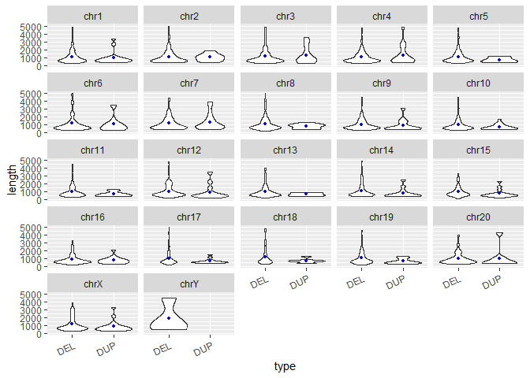<!-- -->

## More on Colors

Colors on graphs can not only make them look nice, but also convey important information, such as differences between groups or the extent to which values vary (e.g. heatmaps). ggplot allows us to color both **continuous** and **discrete** variables, the main difference being that **continuous** variables are colored by gradients and **discrete** ones are colored with individual colors. We also know that aesthetics can have both their border colored with `color` and their shape colored with `fill`.

For the most part we've let ggplot decide on the colors for us. But we can take full control of each color in the plot!

### Revisiting the boxplot - now with color!

Let's take another look at the boxplot we generated showing the distribution of SV lengths of both types (DEL and DUP).

> Run the code block below to re-generate the violin plot from above:


```r
## Construct a violin plot with boxplot to summarize and show shape of SV length distributions by type
sv_len_violin_type_clr <- ggplot(macaque_svs_sep, aes(x=type, y=length, fill=type)) +
  geom_violin() +
  geom_boxplot(width=0.1, outlier.shape=NA, color="#ececec", show.legend=FALSE) +

  ### When prompted, add a scale_fill_manual() layer
  scale_fill_manual(values=c("#920000", "#004949")) +
  ### When prompted, add a scale_fill_manual() layer

  theme(axis.text.x=element_text(angle=25, hjust=1))

print(sv_len_violin_type_clr)
```

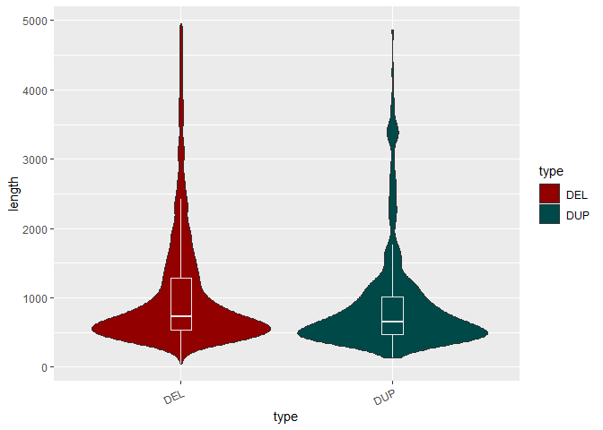<!-- -->

Now let's add some color:

> **Exercise**:
>
> 1. In the code block above, add a `fill=type` definition to the **aesthetics** of the plot and regenerate the figure.
> 
> 2. In the code block above, now add a `scale_fill_manual(values=c("#920000", "#004949"))` **layer**. This defines two **fill** colors, one for each SV type.

What is one problem with this plot the way it is? The box plot is now indistinct.

Colors of different **layers** can be defined independently. If added to the layer directly, no distinction is made between groups.

> 3. In the code block above, add a `color="#ececec"` parameter to the `geom_boxplot()` **layer**.

### Colors for continuous variables (gradients)

So far, we've looked at coloring discrete variables: groups of SV types or chromosomes. However, we can also color **continuous** variables, which are numbers that could take any value.

To get a sense for this, let's look at a scatterplot of average SV length vs. chromosome length for each chromosome in the macaque genome. First, we'll have to read in a table of chromosome lengths for the macaque reference genome.

> Run the code block below to read in a data table of chromosome lengths for the macaque reference genome:


```r
## Read the table with the lengths for each chromosome
macaque_chr_lens <- read.table("https://harvardinformatics.github.io/workshops/2023-fall/r/data/rheMac8.chrom.sizes")

## Add column names since they aren't contained in the file
names(macaque_chr_lens) <- c("chr", "chr.len")

## View the table
macaque_chr_lens
```

```
##      chr   chr.len
## 1   chr1 225584828
## 2   chr2 204787373
## 3   chr5 190429646
## 4   chr3 185818997
## 5   chr6 180051392
## 6   chr4 172585720
## 7   chr7 169600520
## 8   chrX 149150640
## 9   chr8 144306982
## 10 chr11 133663169
## 11  chr9 129882849
## 12 chr14 127894412
## 13 chr12 125506784
## 14 chr15 111343173
## 15 chr13 108979918
## 16 chr17  95684472
## 17 chr10  92844088
## 18 chr16  77216781
## 19 chr20  74971481
## 20 chr18  70235451
## 21 chr19  53671032
## 22  chrY  11753682
```

Ok, so this is a pretty simple dataset: just the chromosome label its the length in base pairs. Let's generate a scatter plot of chromosome length vs. average SV length.

> Run the code block below to make a scatter plot of chromosome length and average SV length:


```r
## First, join the chromosome length data with our SV length data
macaque_svs_chr_merge <- left_join(macaque_svs_chr, macaque_chr_lens, by="chr")

## Remove the Y chromosome now since it is too much of an outlier
macaque_svs_chr_merge <- macaque_svs_chr_merge %>% filter(chr != "chrY")

## Plot chromosome length and average sv length as points on a scatter plot and add a regression line with geom_smooth()
sv_chr_len_scatter <- ggplot(macaque_svs_chr_merge, aes(x=chr.len, y=mean_len, color=chr)) +
  geom_point(size=4) +
  geom_smooth(method="lm", se=F, fullrange=T, color="#333333")

print(sv_chr_len_scatter)
```

```
## `geom_smooth()` using formula = 'y ~ x'
```

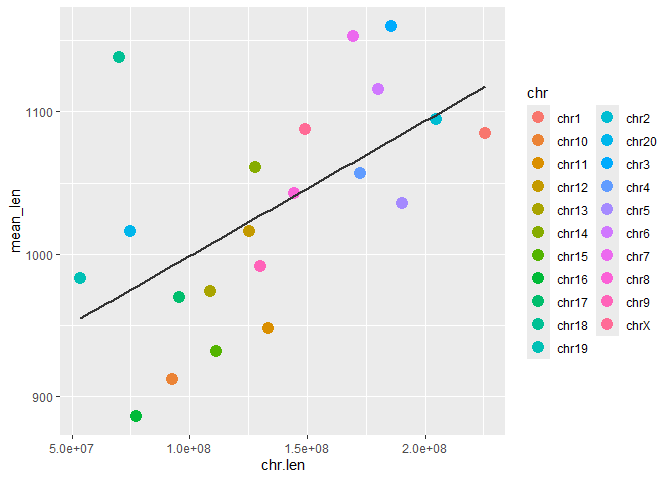<!-- -->

Ok, so it looks like there is some correlation between chromosome length and average SV length. But how can we tell which chromosomes are which? One way is with colors (and a legend):

> **Exercise**:
> Add a `color=chr` parameter to the **aesthetics** of the plot.

Now we can at least link each point to a label in the legend (though the default color scheme here makes some of them difficult to discern).

However this is still a **discrete** coloring.

We can color these points by a third variable. Remember the "score" variable we have for each SV? This is a **continuous** variable so let's color each point by average score instead to see which chromosomes have the highest scoring SVs and see if there is any pattern between the three variables (chromosome length, mean SV length, and mean score).

> Run the following code block to re-generate the scatter plot and color the points by score:


```r
### Load the viridis package here after installation
library(viridis)

## Convert the score to a numeric data type so we can average them per chr
macaque_svs_sep$score <- as.numeric(macaque_svs_sep$score)

## Group the data by chr and average both the length and the score per chr
macaque_svs_chr_score <- macaque_svs_sep %>% group_by(chr) %>% summarize(mean.len=mean(length), mean.score=mean(score, na.rm=T))

## Merge the chromosome length data with our SV length data
macaque_svs_chr_score <- merge(macaque_svs_chr_score, macaque_chr_lens, by="chr")

## Remove the Y chromosome now since it is too much of an outlier
macaque_svs_chr_score <- macaque_svs_chr_score %>% filter(chr != "chrY")

## Plot chromosome length and average sv length as points on a scatter plot and add a regression line with geom_smooth()
sv_chr_len_scatter <- ggplot(macaque_svs_chr_score, aes(x=chr.len, y=mean.len, color=mean.score, label=chr)) +
  geom_point(size=4) +
  geom_smooth(method="lm", se=F, fullrange=T, color="#333333") +
  
  ### Add a geom_text() layer here when prompted
  geom_text(hjust=-0.2, vjust=0.2) +
  
  ### Add a scale_color_continous() layer here when prompted
  #scale_color_continuous(low="#920000", high="#f0e442") +

  ### Add a scale_color_viridis() layer here when prompted
  scale_color_viridis(option="A") +
  
  ### Add a theme() layer here when prompted
  theme_classic() %+replace% 
    theme(axis.text=element_text(size=12), 
          axis.title=element_text(size=16), 
          axis.title.y=element_text(margin=margin(t=0,r=10,b=0,l=0),color="black",angle=90), 
          axis.title.x=element_text(margin=margin(t=10,r=0,b=0,l=0),color="black"),
          axis.line=element_line(colour='#595959',size=0.75),
          axis.ticks=element_line(colour="#595959",size=1),
          axis.ticks.length=unit(0.2,"cm"),
          legend.position="right",
          legend.key.width=unit(0.75,  unit="cm"),
          legend.spacing.x=unit(0.25, 'cm'),
          legend.title=element_blank(),
          legend.text=element_text(size=12),
          plot.title=element_text(hjust=0.5, size=20),
          plot.margin=unit(c(1,1,1,1), "cm")
    )

print(sv_chr_len_scatter)
```

<!-- -->

Here, we've essentially visualized 3 variables at once by adding the color aesthetic. No patterns between score and the other two variables pop out to me. 

### Other color scales

So far, we've only used the default ggplot color scales. But these are completely customizable. We've already seen how to define **manual** color and fill scales for **discrete** variables (see code blocks `iris-plot-5` and `sv-len-violin-type-2`). For continuous variables, the process is similar but instead of defining exact color values, we define the extremes of the color gradient.

> For instance, in the code block above, add the following **layer** to the scatter plot:

```
scale_color_continuous(low="#920000", high="#f0e442")
```

There are other **layer** types for continuous variables, like `scale_color_gradient()` that offer even more control over the colors.

#### Viridis

Of course, we don't always want to be picking colors ourselves. Fortunately there are several pre-compiled color palettes out there, most popular among them is the **viridis** color scale. These can be easily added as **layers** to a ggplot with the *viridis* package. To use viridis color scales, do the following:

> **Exercise**:
>
> 1. Use the **Packages** tab in the lower right hand panel of the RStudio interface to install the **viridis** package.
>
> 2. Once installed, load the package in the previous code block and replace the `scale_color_continuous()` layer with a `scale_color_viridis()` layer.

Viridis layers have several options for different color scales available with the `option=` parameter. 

> What happens when you add `option="A"` to the `scale_color_viridis()` layer? Try out different letter options to see which one you like.

Viridis scales can also be used on discrete variables with the `discrete=TRUE` parameter.

#### Colorblind friendly scales

One major reason for summarizing data in visual representations is to convey its meaning and interpretation to the viewer. And that means its important that every viewer is able to interpret the data readily. Using colorblind-friendly color palettes ensures this is the case and is something I always strive to do.

According to [this page :octicons-link-external-24:](https://cran.r-project.org/web/packages/viridis/vignettes/intro-to-viridis.html){:target="_blank"}
, the default colors used by ggplot can be difficult to discern for viewers with colorblindness. Fortunately, there are plenty of resources to help us pick out colorblind-friendly palettes, as a quick internet search will show. The same page also shows that viridis and its variants are more colorblind friendly.

Here are my preferred discrete colorblind-friendly palettes:

```
c("#db6d00", "#004949", "#006ddb", "#920000", "#490092", "#6cb6ff", "#24ff24", "#fdb4da", "#ffff6d", "#009292", "#924900", "#000000")
## I obtained this palette from a web resource that is no longer active :(

c("#e69f00", "#56b4e9", "#009e73", "#f0e442", "#0072b2", "#d55e00", "#cc79a7", "#000000")
## I got this palette from Claus Wilke's book

```

For continuous scales, I would use Viridis.

### Adding text to a plot

Another way to differentiate discrete points is by adding text to the plot. For instance, in our scatter plot above, we know that each point corresponds to a different chromosome, but it is unclear which point is which chromosome. Even with the discrete coloring by chromosome there are simply too many similar points to tell clearly.

Fortunately, another **aesthetic** can be added: `label`. With `label=`, we can use additional **layers** to tell how to annotate the plot with text. 

> In the code block above, add the `label=chr` **aesthetic**, and then add the following `geom_text()` **layer**:

```
geom_text()
```

This is ok, but the points and labels overlap so we can't read them! We'll need to adjust the position of the labels with the `hjust=` and `vjust=` options in the `geom_text()` layer:

> Add the following options to the `geom_text()` layer you just added in the code block above to slightly shift their positions off of the points:

```
geom_text(hjust=-0.2, vjust=0.2) +
```

Better! However, this can be tedious. Fortunately, there is a package called [**ggrepel** :octicons-link-external-24:](https://ggrepel.slowkow.com/){:target="_blank"}
 that does this automatically. We won't worry about installing this now, but I just wanted you to be aware of it.

### Themes and theme()

The "theme" of a plot refers to the style elements not related to the **aesthetics**, such as axis font sizes, grid-lines, margins, etc. Until now, we have been using the default ggplot theme elements, but every aspect of the theme of a plot is customizable by adding the catch-all `theme()` layer. ggplot also provides some [pre-set alternate themes as layers :octicons-link-external-24:](https://ggplot2.tidyverse.org/reference/ggtheme.html){:target="_blank"}
. 

Let's try some of these pre-set themes out first. 

> **Exercise**:
> In the code block above, add the following layers onto one of the plots we've generated in today's class, one at a time:

- `theme_grey()` : This is the default ggplot theme, so shouldn't change anything
- `theme_bw()`
- `theme_linedraw()`
- `theme_light()`
- `theme_dark()`
- `theme_minimal()`
- `theme_classic()`
- `theme_void()`
- `theme_test()`

The `theme()` layer is rich with options, which you will have to explore when generating your own figures. Here are my preferred theme settings, which are a variant on theme_classic. 
> **Exercise**:
> Try adding this `theme()` **layer** to the scatterplot in the code block above:

```
  theme_classic() %+replace% 
    theme(axis.text=element_text(size=12), 
          axis.title=element_text(size=16), 
          axis.title.y=element_text(margin=margin(t=0,r=10,b=0,l=0),color="black",angle=90), 
          axis.title.x=element_text(margin=margin(t=10,r=0,b=0,l=0),color="black"),
          axis.line=element_line(colour='#595959',size=0.75),
          axis.ticks=element_line(colour="#595959",size=1),
          axis.ticks.length=unit(0.2,"cm"),
          legend.position="right",
          legend.key.width=unit(0.75,  unit="cm"),
          legend.spacing.x=unit(0.25, 'cm'),
          legend.title=element_blank(),
          legend.text=element_text(size=12),
          plot.title=element_text(hjust=0.5, size=20),
          plot.margin=unit(c(1,1,1,1), "cm")
    )
```

### Multi-panel figures

We saw above that `facet_wrap()` can provide us with some rudimentary multi-panel figures, as long as the panels are meant to be different groupings from the same variable and the same type of plot. `facet_grid()` gives a bit more control over the placement of the panels, but for true multi-panel figures, that mix data sources and aesthetics (plot types), we'll need to look elsewhere. There are many packages that work with ggplot that give us the ability to group different graphical objects (or **grobs**) into grids and label each panel. The one we're going to show you today is called [**cowplot** :octicons-link-external-24:](https://wilkelab.org/cowplot/articles/introduction.html){:target="_blank"} which implements the function `plot_grid()` to combine **grobs**.

> So, first, we'll need to install the **cowplot** package. Let's do that in the **Packages** tab on the right.

With cowplot installed, we can combine two of the figures we've already generated in the workshop.

> Run the following code block to combine our scatter-plot of chromosome length vs. average SV length and the violin plot showing the differences in length between deletions and duplications:


```r
## Combine the scatter and violin plots into one grob
scatter_and_violin <- plot_grid(sv_chr_len_scatter + theme_grey(), sv_len_violin_type_clr, ncol=2, labels=c("A", "B"))
```

```
## `geom_smooth()` using formula = 'y ~ x'
```

```
## Warning: The following aesthetics were dropped during statistical transformation: label.
## i This can happen when ggplot fails to infer the correct grouping structure in
##   the data.
## i Did you forget to specify a `group` aesthetic or to convert a numerical
##   variable into a factor?
```

```r
## Display the figure
print(scatter_and_violin)
```

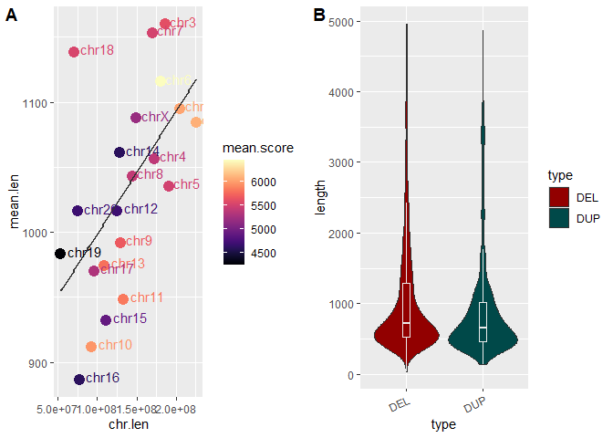<!-- -->

> Now, let's switch this from two rows to two columns by changing the `nrow=` option to `ncol=`.

Looks good! Except maybe that the themes of the two figures don't match anymore since we changed the scatterplot. Recall that **grobs** are stored as objects and can therefore be manipulated later. 

> Let's change the theme back by adding `+ theme_grey()` **as we're adding the scatterplot to the multi-panel figure in `plot_grid()`** in the code block above.

We can also combine this multi-panel figure with other figures with another call to `plot_grid()`. 

> Run the following code to add a row to our figure showing the barplot of proportions of SV types per chromosome:


```r
### When prompted, add plot_grid() for the barplot here
barplot_row <- plot_grid(NULL, sv_count_bar_chr_prop, NULL, ncol=3, labels=c("", "C", ""), rel_widths=c(0.1,1,0.1))

## Combine the two panels generated above with the barplot showing proportions
figure_1 <- plot_grid(scatter_and_violin, barplot_row, nrow=2)

## Display the figure
print(figure_1)
```

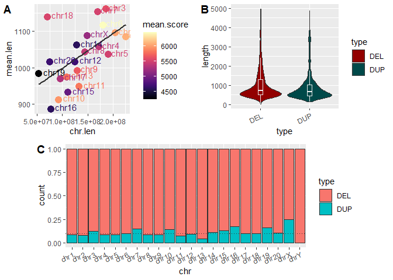<!-- -->

But what if we don't want the bar plot to take up the whole bottom row? Well, we can combine two other functions of `plot_grid()`: `NULL` panels and relative panel widths (`rel_width()`). 

> Add the following code to the code block above, and then **replace the name of the barplot in the second `plot_grid()` call with the new grob (`barplot_row`)**.

```
barplot_row <- plot_grid(NULL, sv_count_bar_chr_prop, NULL, ncol=3, labels=c("", "C", ""), rel_widths=c(0.1,1,0.1))
```

Now that's a figure (almost) ready for publication!

cowplot has other capabilities that we won't cover today, such as `plot_grid()` receiving a *list of grobs* as input (as opposed to typing the name of each one out) and the `get_legend()` function that allows us to save only the legend from a particular grob as its own grob, which can then be added onto a multi-panel figure as a shared legend.

---
